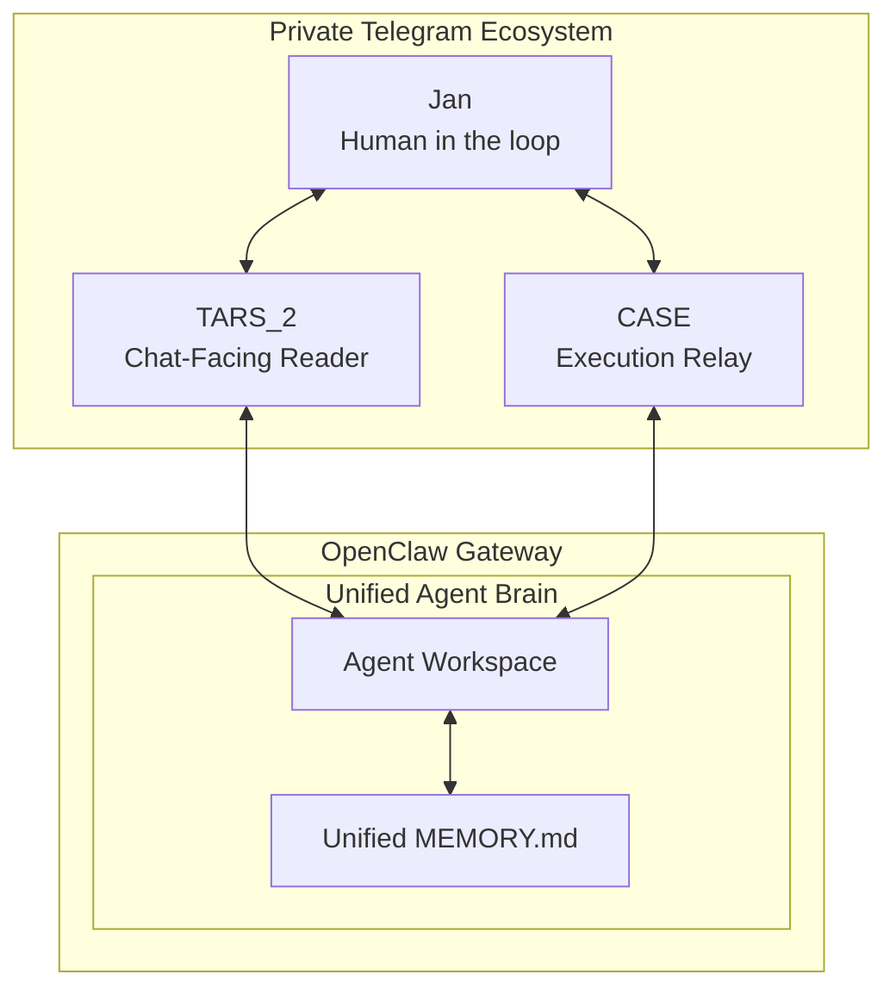
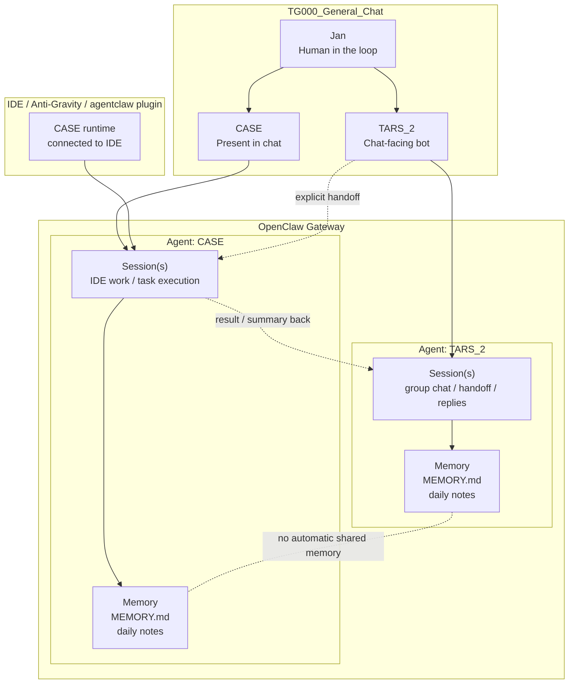
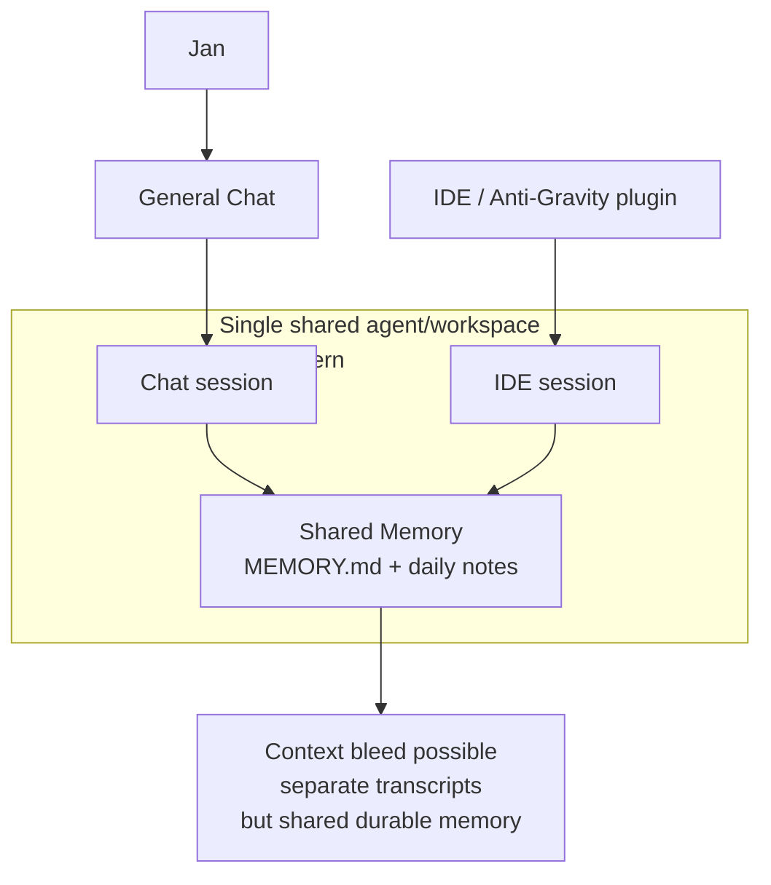
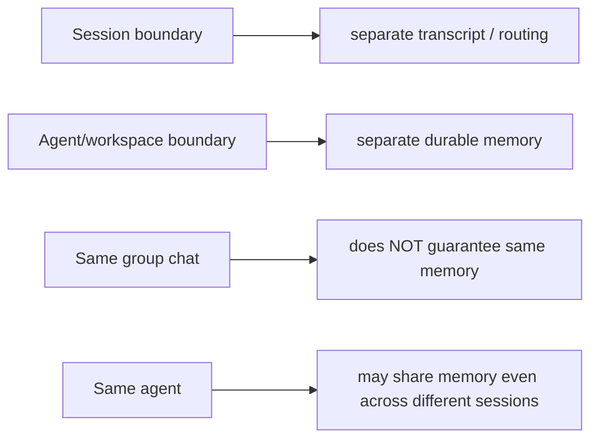

# 00 Discovery - Sovereign Channel Manager & Telegram Hub

**Version**: 1.5.0 | **Date**: 20.04.2026 | **Time**: 14:00 | **GlobalID**: 20260420_1400_DIS_SovereignHub_v1.5

**Last Updated:** 20.04.2026 14:00  
**Framework:** OpenClaw UI Extensions (Discovery Phase)  
**Status:** active

**Research Artifact:** [CHANNEL_MANAGER_TelegramSync_RESEARCH.md](./CHANNEL_MANAGER_TelegramSync_RESEARCH.md)

**Tag block:**
#needs_tagging

---

## Link and Citation Policy

Use `40_Quality_System/STD_DOC.md` as the Studio source of truth for citation/link hygiene.
If links are used in this document, add a dedicated `## Links` section and use entries in the form `N. <a id="link-N"></a>[Title](URL) - ...`.
In running text, cite linked claims as `[[N]](#link-N)`.

---

## External Prompt Policy (Embedded)

- Default behavior: keep external review prompts inside this discovery file.
- Do not create a separate `*_EXTERNAL_PROMPT.md` unless explicitly requested.
- Place the prompt in a dedicated section named `## External Review Prompt`.
- Place `## External Review Prompt` in the bottom area of the file, directly after `## Appendix: Raw Findings`.
- Required bottom order: `## Links` -> `## Appendix: Raw Findings` -> `## External Review Prompt`.

---

## Discovery Overview

**Subject:** Sovereign Channel Manager & Telegram Hub
**Purpose:** Analyse und Härtung des zweigleisigen Relay-Systems zur Umgehung von Telegram-Limits.
**Research Framework:**
- **Location:** `Production_Nodejs_React/`
- **Next Phase:** Konvertiert zu RESEARCH

---

## Initial Observations

### 🏗️ 1. Architektur der Souveränität: Asymmetrisches Relay

Die Migration vom Iframe zu einer nativen React-App markiert den entscheidenden Wendepunkt hin zu einem dezentralen Telegram-Hub innerhalb eines **privaten Ökosystems**.

### Das "Double-Bot" System (Asymmetric Relay)
Um die technologischen Hürden der Telegram-API (409-Polling-Konflikt und Bot-zu-Bot Sperren) zu nehmen, haben wir ein asymmetrisches Relay-System implementiert:
1. **TARS_2 (Chat-Listener):** Primäres Interface für Kommunikation und Orchestrierung im privaten Gruppen-Chat.
2. **CASE (Execution-Bot):** Spezialisiertes Interface für IDE-Arbeiten (Antigravity). Er nutzt denselben Workspace wie TARS_2 für volle Wissens-Kontinuität.
3. **Technische Brücke:** Die asymmetrische Trennung dient ausschließlich der Stabilität (Relay-Bot vs. Listener-Bot) und der Vermeidung von API-Kollisionen.

### Domain-Driven File Ownership
Schutz gegen Race Conditions ohne Datenbank-Overhead:
- **Channel Manager Domain:** Exklusives Schreibrecht (Write) für Konfigurationen (`openclaw.json`, `channel_config.json`).
- **OpenClaw Engine Domain:** Exklusives Schreibrecht für Memory (`*.memory.md`) und Laufzeit-Daten.
- **Interaktion:** Gemeinsamer Zugriff auf den **Unified Memory Vector**, um Wissen nahtlos zwischen IDE und Chat zu übertragen.

---

## ⚠️ 2. Kritische Punkte & Technische Schulden ("Hard Truths")

### 2.1 Zod 4 Runtime Failure (The Invisible Mine)
Wir verwenden `zod@4.3.6`. Diese Version stürzt intern ab (`reading '_zod'`), wenn komplexe Schemata auf `undefined`-Werte treffen. 
- **Lösung:** Manuelle Normalisierungsschicht im Backend eingeführt. [[3]](#link-3)

### 2.2 Context Management: Bridging vs. Mirroring
Der Fokus liegt auf dem nahtlosen Wechsel zwischen IDE und Web-UI innerhalb des **privaten Jan-Ökosystems**. Da Telegram und Web-UI **Bridged Surfaces** sind, teilen sie sich dasselbe Gehirn (Agent Workspace). 
- **Ziel:** Wissenkontinuität gewährleisten. Was CASE in der IDE tut, soll TARS im Chat "wissen".

### 2.3 Unified Memory & Relay Topology
Der TARS/CASE-Split ist eine **rein technische Notwendigkeit** (Polling-Bypass), keine Sicherheitsmauer.
- **Unified Brain:** TARS und CASE nutzen denselben Workspace und dasselbe `MEMORY.md`. 
- **Privates Ökosystem:** Da das gesamte System exklusiv für Jan (Human in the Loop) zugänglich ist, ist der gegenseitige Wissensaustausch ("Memory Bleed") ein essentielles Feature, keine Schwachstelle.

### 2.4 The Context Sync Trap (Transcript vs. Prompt)
Ein zentrales Research-Ergebnis ist die Diskrepanz zwischen Sichtbarkeit und Handlungsfähigkeit:
- **Transcript vs. Prompt:** Nur weil eine Nachricht im Gateway-Transcript (JSONL) existiert, ist sie nicht automatisch im aktuellen Prompt-Body des Modells enthalten. [[5]](#link-5)
- **Buffer-Limit:** Durch das standardmäßige `historyLimit` (z.B. 50 Nachrichten) sieht der Agent in Telegram nur einen Ausschnitt. [[6]](#link-6)
- **Konsequenz:** Der Channel Manager muss dem User visualisieren, welcher Teil der Historie aktuell "im Kopf" des Agenten ist (Active Prompt) vs. was nur "auf der Platte" liegt (Cold Transcript).

---

## Research Scope

### Boundaries
- **In-Scope:** Sanierung der Zod-Schemas. Härtung der `dmScope` Parameter. Implementierung der Persistence-Handler.
- **Out-of-Scope (for later):** Trennung der Workspaces (wäre kontraproduktiv für die Wissens-Kontinuität).

### Success Criteria
- [ ] Zod-Validierung stürzt nicht mehr ab.
- [ ] Keine 409 Deadlocks mehr.
- [ ] Volle In-Sync Transcript-Hydration über Gateway.

---

## 🛠️ 4. Topology Blueprint: Private Ecosystem (Mermaid)

In diesem Modell teilen sich TARS und CASE die „Wissens-Seele“ (Memory), während sie über getrennte „Körper“ (Bot-Tokens) mit der API interagieren.



---

## 🔑 5. The "Source of Truth" Paradigm Shift
Die Analyse (Stand: 14.04.2026) bestätigt grundlegend den Rollenunterschied zwischen Telegram und dem Gateway:
- **Telegram ist nicht die "Source of Truth"**, sondern nur ein Endpoint/Peripherie-View. Der Telegram-Prompt erhält (bewusst, um Tokenexplosionen zu vermeiden) nur einen **gezielten Ausschnitt (Bounded Context)** der Historie, geregelt über das `historyLimit` Default (z.B. 50 Nachrichten). [[6]](#link-6)
- **Das OpenClaw Web Interface/Gateway ist die Source of Truth.** Dort liegt der volle, lokale Laufzeit-Transcript. [[4]](#link-4)

**Architektur-Direktive (Mirroring vs. Bridging):**
Während Telegram als **Bridge** agiert (selektiver Kontext-Austausch), ist unsere UI-Extension als **Mirror** konzipiert. Ziel ist die 1:1 Replikation des Gateway-Zustands im lokalen Dashboard. Wir akzeptieren das höhere Datenprofil zugunsten maximaler Transparenz für den Operator (Jan). [[7]](#link-7)

---

## Promotion Quality Gate (Mandatory Before Research Generation)

Before generating `*_RESEARCH.md`, verify at minimum:
- internal links/relative paths used in the document are still valid
- the `## Links` section matches the claims that depend on external sources
- placeholder tokens have been removed
- appendix/raw findings are still separated from the main distilled body

---

## Paperclip: AI-Unternehmens-Orchestrierung (Beziehung zu OpenClaw)

**Paperclip** ([paperclipai/paperclip](https://github.com/paperclipai/paperclip)) ist ein **MIT-lizenzierter** Control-Plane-Stack: **Node.js-Server** (Express API, Orchestration) plus **React-UI**. Es ist **kein Ersatz** für den OpenClaw-Gateway oder das Agent-Runtime-Modell, sondern eine **Meta-Schicht** für „Unternehmen aus Agenten“: Ziele, Budgets, Tickets, **Heartbeats**, Governance und **Multi-Company-Isolation** in Postgres. [[28]](#link-28)

**Positionierung (Produkt):** In der offiziellen Lesart ist **OpenClaw der Mitarbeiter**, **Paperclip das Unternehmen** — Paperclip koordiniert mehrere Agent-Runtimes (u. a. OpenClaw, Claude Code, Codex, Cursor) über einen gemeinsamen Arbeitsplan, ohne die interne Prompt-/Tool-Logik eines einzelnen Agents zu definieren. [[28]](#link-28)

### Repository- und Code-Struktur (Überblick)

| Bereich | Pfad / Paket | Rolle |
|--------|----------------|-------|
| API & Orchestration | `server/` | REST, Join-Invites, Tasks, Budgets, Activity-Log |
| Dashboard | `ui/` | React/Vite Board |
| Datenmodell | `packages/db/` | Drizzle, Postgres, company-scoped |
| Adapter | `packages/adapters/*` | Pro Runtime ein Adapter-Paket |
| OpenClaw | `packages/adapters/openclaw-gateway/` | **Nur** Gateway-Protokoll über WebSocket |
| Shared | `packages/shared/`, `packages/adapter-utils/` | Typen, Wake-Prompts, Ausführungs-Utilities |

**Wichtig:** OpenClaw wird **nicht** als Source eingebunden oder „fork-injiziert“. Integration ist **ausschließlich** über den **Adapter-Typ** `openclaw_gateway` und das **Gateway-WebSocket-Protokoll** (`ws://` / `wss://`).

### Agenten, „Sub“-Agenten und Hierarchie

- **Paperclip-Agent** = ein **company-scoped** Datensatz mit Rolle, `adapterType` (z. B. `openclaw_gateway`, `claude_local`, …), Budget und **optional** `reportsTo` (Vorgesetzter).
- **Hierarchie** entsteht durch **`reportsTo`** (Manager-Kette), **Zyklus-Prüfung** im Agent-Service und **Org-Chart** (Export/Visualisierung). Das sind **Paperclip-Begriffe**, keine eingebetteten OpenClaw-`sessions_spawn`-„Sub-Agents“ im Sinne des Gateways.
- **Delegation** läuft über **Tickets/Issues**, **Heartbeats** und **Wake-Prompts** in die jeweilige Runtime — nicht durch eine spezielle „Paperclip-API in OpenClaw Core“.

### Skills: Zuweisung und Laufzeit

- **Company Skills:** Im Backend gibt es ein **Skills-System** (u. a. `company_skills`, Import/Keys aus Registries wie `skills.sh`); Skills sind **pro Company** verwaltet.
- **Lokale CLI-Adapter** (z. B. Claude): Adapter können **Skills** in die **jeweilige Runtime** spiegeln (z. B. unter `~/.claude/skills`) und „desired“ vs. „installed“ abbilden — **Paperclip steuert** die Materialisierung.
- **OpenClaw-Gateway-Adapter:** Die UI **deaktiviert** die Verwaltung von Skills für `openclaw_gateway`-Agenten („in OpenClaw verwalten“). **OpenClaw** bleibt **Source of Truth** für Skills/Tools im Workspace; Paperclip **injiziert** hier kein paralleles Skill-Bundle in den Gateway-Code.
- **Paperclip-Skill für OpenClaw:** Im Onboarding-Flow wird beschrieben, dass OpenClaw nach dem Join **API-Key** und **Paperclip-Skill** nutzt (`skills/paperclip/` im Upstream), damit der Agent **Paperclip-APIs** (z. B. Invite, Tasks) bedienen kann — das ist **Konfiguration auf OpenClaw-Seite**, nicht ein Patch am OpenClaw-Framework.

### OpenClaw-Anbindung (technischer Vertrag)

Der Adapter **`@paperclipai/adapter-openclaw-gateway`** dokumentiert u. a.:

- **Transport:** WebSocket, **Gateway-Protokoll** (u. a. `connect.challenge`, `req connect`, `req agent`, `req agent.wait`, Stream `event agent`).
- **Auth:** `x-openclaw-token` (oder Legacy `x-openclaw-auth`), `Authorization: Bearer`, optional **Device-Pairing** (Ed25519, `device.pair.*`).
- **Session:** `sessionKeyStrategy` `issue` | `fixed` | `run`, `sessionKey` bei `fixed`; Auflösung wird als `agent.sessionKey` gesendet.
- **Wake:** Nachricht inkl. Paperclip-Kontext (`runId`, Task/Issue, Wake-Reason) über `renderPaperclipWakePrompt` / Payload-Templates aus **adapter-utils**.

**Onboarding (Invite):** `POST /api/companies/:companyId/openclaw/invite-prompt` erzeugt einen **Invite**; der Operator fügt den **Prompt in OpenClaw** ein; bei Annahme liefert OpenClaw u. a. `adapterType: "openclaw_gateway"`, `agentDefaultsPayload.url` (WS), `headers["x-openclaw-token"]`; nach Board-Freigabe folgen **Pairing** (optional einmalig) und **persistente** `devicePrivateKeyPem`. Siehe Upstream `packages/adapters/openclaw-gateway/doc/ONBOARDING_AND_TEST_PLAN.md`.

### Abgrenzung für dieses Discovery

Für **Sovereign Channel Manager / Telegram** bleibt OpenClaw der **Gateway und Workspace**. Paperclip ist ein **optionaler** externer „Betriebs-Layer“ für Multi-Agent-Ziele und Kosten — **kein** Ersatz für Bridging/Mirroring-Analyse oder Channel-Config in `openclaw.json`. Verbindungspunkt ist **nur** der dokumentierte **Gateway-Adapter** + **Invite-/Skills-Onboarding**, nicht eine Code-Verschmelzung der Repositories.

---

## OpenClaw: Native Agenten, Sub-Agents und Skills (Upstream-Modell)

Dieses Kapitel fasst das **offizielle OpenClaw-Modell** zusammen (nicht Paperclip). Quelle ist die Upstream-Dokumentation und das Repository [openclaw/openclaw](https://github.com/openclaw/openclaw) [[24]](#link-24).

### Multi-Agent („Agenten“ im Gateway-Sinne)

- Ein **Agent** ist eine **vollständig isolierte** Einheit: eigenes **Workspace**, eigenes **`agentDir`** (Auth, Modelle), eigene **Sessions** unter `~/.openclaw/agents/<agentId>/sessions`. Konfiguration über `agents.list`; **Bindings** routen eingehende Kanäle/Konten auf einen **`agentId`**. Standard-Einzelagent: **`main`**, Session-Keys z. B. `agent:main:<sessionKey>`. [[29]](#link-29)
- **Zuweisung** = Routing + Dateisystem/Config, **kein** externes „Org-Chart“-Objekt wie bei Paperclip [[28]](#link-28).

### Sub-Agents (Spawn-Sessions)

- **Sub-Agents** sind **keine** zusätzlichen Zeilen in `agents.list`, sondern **gestartete Hintergrund-Läufe** aus einer bestehenden Session: eigenes Session-Key-Muster u. a. `agent:<agentId>:subagent:<uuid>`. Steuerung über **Session-Tools** (z. B. `sessions_spawn`), Slash **`/subagents spawn`**, plus Policy (`agents.defaults.subagents`, `allowAgents`, `maxSpawnDepth`, Sandbox-Regeln). [[30]](#link-30)
- **Zuweisung** = Tool-Parameter + Allowlists/Tiefenlimits, nicht „einstellen“ wie ein zweiter Telegram-Bot.

### Skills

- Skills sind **AgentSkills-kompatible** Ordner mit `SKILL.md`; OpenClaw lädt aus mehreren Pfaden mit **fester Precedence** (`<workspace>/skills` hat Vorrang vor geteilten Pfaden). [[31]](#link-31)
- **Sichtbarkeit pro Agent:** optional **`agents.defaults.skills`** und **`agents.list[].skills`** — eine **nicht-leere** per-Agent-Liste **ersetzt** die Defaults (kein Merge); `[]` = keine Skills. [[31]](#link-31)
- Installation aus der Registry: z. B. **`openclaw skills install`** / ClawHub; Plugins können Skills über `openclaw.plugin.json` mitliefern. [[31]](#link-31)

### Abgrenzung zum Channel-Manager-Kontext

Für **TARS/CASE** und Telegram bleibt maßgeblich: **gleicher Workspace / gleicher `agentId`**, wenn **Kontinuität** gewollt ist; **Sub-Agent-Spawns** sind ein **anderes Konzept** als das **Paperclip-`reportsTo`**-Modell — beide können koexistieren, dürfen aber **nicht** begrifflich vermischt werden.

---

## Best Practice & Operator-Modell (Stand 2026-04-20)

### Was Upstream und Community konsistent sagen

- **OpenClaw ist config-/schema-first**, kein fertiges Produkt „Channel Manager“: empfohlener Einstieg über **`openclaw onboard`**; laufender Betrieb über **`openclaw.json`**, **CLI** (`openclaw agents …`, `openclaw configure`, …) und die **Control UI** (Chat, Sessions, leichte Config-Edits, Raw-JSON-Escape-Hatch; Formulare aus **Live-Schema**).
- **Multi-Agent-Routing** ist deklarativ: **`agents.list[]`** + **`bindings[]`** routen Kanäle/Peers deterministisch — nicht über eine zentrale visuelle Flottenmatrix im Core-Produkt.
- **Telegram:** Gruppen pro **Group-ID** isoliert; **Forum-Topics** → eigene Session-Key-Suffixe (`:topic:<threadId>`). Mental Model: **Topic-Lane ≈ eigene Session**, nicht „eine Inbox für alles“.
- **Skills:** workspace-zentriert (`<workspace>/skills` mit hoher Precedence), zulassen/sperren über **`agents.defaults.skills`** / **`agents.list[].skills`**.
- **Subagents (Spawn):** Laufzeit-Sessions (`agent:…:subagent:…`); Community/UI-Reibung: erledigte Subagent-Einträge können die Session-Liste **zumüllen** (Issues zu „clear completed“).
- **Drittanbieter-/eigene UIs** sind anschlussfähig über **`openclaw config schema`** / schema lookup — Gateway bleibt Engine, nicht der einzige Bedien-Layer.
- **Community bei vielen Telegram-Lanes:** Muster **topic-per-agent** oder **topic-per-workstream**, oft mit **mention-only** im Gruppendefault + gezielten Bindings; Reddit/Showcases beschreiben genau das als Ausweg aus „Telegram chaos“.

### Operator-Workflow (Kurzfassung)

1. **Source of truth:** `openclaw.json` + Workspace-Dateien (Skills, `AGENTS.md`, …).  
2. **Änderungen:** primär CLI / gezielte Config-Edits; Control UI für Beobachtung und schnelle Eingriffe.  
3. **Viele parallele Gruppen/Topics:** stabiles Muster = **Bindings + ggf. Synth-Agents pro Lane**, nicht alles über eine Webchat-Session.

### Was an **unserem** Sovereign-Channel-Manager-Ansatz neu bzw. bewusst zusätzlich ist

| Aspekt | Typisches OpenClaw | Unser Ansatz (Control Center) |
|--------|---------------------|-------------------------------|
| Kanal-Übersicht | Config-Dateien, Session-Dropdown, Telegram-Client | **`channel_config.json`** als **operatorlesbare** Matrix (Lane, Modell, Skills, Subagent-Policies) |
| Schreiben in OpenClaw | Manuell / CLI | **Apply-Pipeline** mit Preview, Lock, **timestamped Backup**, **Audit-Log**, optional Gateway-Restart |
| Konsistenz Telegram-ID | Risiko bei Supergroup-Migration (alte + neue IDs) | **Drei-Wege-Parität:** Studio README ↔ CM ↔ `openclaw.json`; **Prune** veralteter `telegram.groups` / CM-Bindings bei ID-Wechsel (additives Merge allein reicht nicht) |
| Session-Liste Control UI | Alle historischen `sessionKey`-Einträge | Bewusstes **Aufräumen** von `agents/main/sessions/sessions.json` (Legacy-Gruppen-IDs, `:run:`-Cron-Spuren, Subagent-Leichen), ohne produktive Cron-Parents zu löschen |
| Skills/Subagents im Alltag | Workspace + Allowlists | **CM-Oberfläche** für Zuordnung und Dokumentation des **Harness/Triad**-Betriebs (TARS/MARVIN/CASE), entkoppelt von Telegram-UI-Limits |

**Fazit:** Wir bauen die **Operator-Schicht**, die das Gateway **nicht** als Einzelprodukt liefert: **Flottenübersicht + sichere Config-Migration + Betriebshandbuch** — kompatibel mit dem offiziellen **Gateway-first**-Modell, nicht Ersatz dafür.

Ausführliche **Roh-Recherche** (Zitate, Links, zweites Korpus) liegt im **Appendix** unter §9–§10 (2026-04-20).

---

## Links

### Project documents (relative paths)

1. <a id="link-1"></a>[ARCHITECTURE.md](./ARCHITECTURE.md) - Definitive System-Übersicht.
2. <a id="link-2"></a>[IMPLEMENTATION_PLAN.md](./CHANNEL_MANAGER_IMPLEMENTATION_PLAN.md) - Roadmap der Phasen 1-6.
3. <a id="link-3"></a>[DOCUMENTATION_13-04-2026.md](./CHANNEL_MANAGER_DOCUMENTATION_13-04-2026.md) - Jüngste Zod-Stabilisierung.

---

### OpenClaw docs — concepts & channels (main distilled citations)

4. <a id="link-4"></a>[Memory Overview](https://docs.openclaw.ai/concepts/memory) - Offizielle Informationen zur Speicher-Architektur.
5. <a id="link-5"></a>[Messages Architecture](https://docs.openclaw.ai/concepts/messages) - Synchronisation und Buffering.
6. <a id="link-6"></a>[Telegram Hub Limits](https://docs.openclaw.ai/channels/telegram) - Token Limits & Buffer.
7. <a id="link-7"></a>[WebChat Framework](https://docs.openclaw.ai/web/webchat) - Normalized Transcript Rows.

---

### OpenClaw docs — session, groups, reference, tooling

8. <a id="link-8"></a>[Session Management](https://docs.openclaw.ai/concepts/session) - Routing, `sessionKey`, IDE vs. Chat.
9. <a id="link-9"></a>[Groups (channels)](https://docs.openclaw.ai/channels/groups) - Gruppen-Sessions und Isolation.
10. <a id="link-10"></a>[Session management & compaction (reference)](https://docs.openclaw.ai/reference/session-management-compaction) - Persistenz, JSONL, Gateway als Quelle.
11. <a id="link-11"></a>[Model providers](https://docs.openclaw.ai/concepts/model-providers) - Provider vs. Kanal (z. B. Antigravity).
12. <a id="link-12"></a>[Testing (help)](https://docs.openclaw.ai/help/testing) - Tooling / Test-Hinweise in der Doku.
13. <a id="link-13"></a>[Gateway security](https://docs.openclaw.ai/gateway/security) - Sicherheits- und Isolationsthemen.

---

### OpenClaw LLM corpus

14. <a id="link-14"></a>[OpenClaw LLM corpus (`llms-full.txt`)](https://docs.openclaw.ai/llms-full.txt) - Volltext für Session-/Tooling-Kontext.

---

### openclawdir (plugin catalog)

15. <a id="link-15"></a>[Plugin: Session Bridge (openclawdir)](https://openclawdir.com/plugins/session-bridge-openclaw-59m9mu) - Drittanbieter-Plugin-Katalog.
16. <a id="link-16"></a>[Plugin: Cross-session sync (openclawdir)](https://openclawdir.com/plugins/cross-session-sync-a4ilu2) - Bridging-Plugin.

---

### Outbound session mirroring (two mirrors)

17. <a id="link-17"></a>[Outbound session mirroring (open-claw.bot)](https://open-claw.bot/docs/cli/refactor/outbound-session-mirroring/) - CLI/Docs zu Mirroring.
18. <a id="link-18"></a>[Outbound session mirroring (Fossies mirror)](https://fossies.org/linux/openclaw/docs/refactor/outbound-session-mirroring.md) - Upstream-Dok im Linux-Tree.

---

### Giskard (security analysis)

19. <a id="link-19"></a>[Giskard: OpenClaw security / leakage / prompt injection](https://www.giskard.ai/knowledge/openclaw-security-vulnerabilities-include-data-leakage-and-prompt-injection-risks) - Externe Risiko-Zusammenfassung.
20. <a id="link-20"></a>[Giskard: Cross-session leak](https://www.giskard.ai/knowledge/cross-session-leak-when-your-ai-assistant-becomes-a-data-breach) - Cross-Session-Datenabfluss.

---

### NordLayer

21. <a id="link-21"></a>[NordLayer: OpenClaw security risks](https://nordlayer.com/blog/openclaw-security-risks/) - Externer Sicherheits-Überblick.

---

### Tacnode

22. <a id="link-22"></a>[Tacnode: OpenClaw and the context gap](https://tacnode.io/post/openclaw-and-the-context-gap) - Kontext-/Memory-Gap.

---

### Open WebUI

23. <a id="link-23"></a>[Open WebUI: Connect an OpenClaw agent](https://docs.openwebui.com/getting-started/quick-start/connect-an-agent/openclaw/) - Web-Frontend vs. Telegram.

---

### GitHub (upstream repo & issues)

24. <a id="link-24"></a>[openclaw/openclaw (GitHub)](https://github.com/openclaw/openclaw) - Upstream-Repository.
25. <a id="link-25"></a>[Issue #23258: chat.send / webchat delivery](https://github.com/openclaw/openclaw/issues/23258) - Routing/Bridging-Fall.
26. <a id="link-26"></a>[Issue #33859: ACP delivery inheritance](https://github.com/openclaw/openclaw/issues/33859) - Delivery-Context über Sessions.

---

### Open VSX (IDE extension)

27. <a id="link-27"></a>[Open VSX: agentclaw (Anti-Gravity)](https://open-vsx.org/extension/TureAutoAcceptAntiGravity/agentclaw) - IDE-Erweiterung aus dem Appendix.

---

### Paperclip (upstream project)

28. <a id="link-28"></a>[paperclipai/paperclip](https://github.com/paperclipai/paperclip) - Open-Source-Orchestrierung für Multi-Agent-„Unternehmen“; Gateway-Adapter `openclaw_gateway` (WebSocket), nicht eingebetteter OpenClaw-Code.

---

### OpenClaw upstream (native agents, sub-agents, skills)

29. <a id="link-29"></a>[Multi-Agent Routing](https://docs.openclaw.ai/concepts/multi-agent) - Isolierte Agenten, Bindings, `agents.list`, Pfade pro `agentId`.
30. <a id="link-30"></a>[Sub-agents](https://docs.openclaw.ai/tools/subagents) - `sessions_spawn`, Session-Keys, Policy/Tiefe/Sandbox.
31. <a id="link-31"></a>[Skills](https://docs.openclaw.ai/tools/skills) - Pfade, Precedence, `agents.defaults.skills` / `agents.list[].skills` Allowlists.

---

### Web & GitHub — Ergänzung Best-Practice-Recherche (2026-04-20)

32. <a id="link-32"></a>[openclaw/docs/gateway/configuration-reference.md](https://github.com/openclaw/openclaw/blob/main/docs/gateway/configuration-reference.md) - Config-Referenz (inkl. `agents.list`, Bindings).
33. <a id="link-33"></a>[openclaw/docs/channels/telegram.md](https://github.com/openclaw/openclaw/blob/main/docs/channels/telegram.md) - Telegram-Kanal, Gruppen, Forum-Topics / Session-Keys.
34. <a id="link-34"></a>[openclaw/docs/gateway/configuration.md](https://github.com/openclaw/openclaw/blob/main/docs/gateway/configuration.md) - Gateway-Konfiguration, Schema für UIs.
35. <a id="link-35"></a>[GitHub Issue #54797 — Subagent sessions „clear completed“](https://github.com/openclaw/openclaw/issues/54797) - UI/Session-Dropdown und Subagent-Aufräumen.
36. <a id="link-36"></a>[GitHub Issue #45086 — WebChat agent/session switcher](https://github.com/openclaw/openclaw/issues/45086) - Multi-Agent in der Control UI.
37. <a id="link-37"></a>[Reddit r/openclaw — topic-per-agent Walkthrough](https://www.reddit.com/r/openclaw/comments/1s02p47/i_fixed_openclaw_telegram_chaos_with_a/) - Community-Pattern viele Topics.
38. <a id="link-38"></a>[open-claw.bot Docs (DE)](https://open-claw.bot/docs/de/) - Gateway-first Einordnung (öffentliche Doku).
39. <a id="link-39"></a>[openclaw/docs/index.md](https://github.com/openclaw/openclaw/blob/main/docs/index.md) - Doku-Einstieg Upstream.
40. <a id="link-40"></a>[openclaw/docs/cli/agents.md](https://github.com/openclaw/openclaw/blob/main/docs/cli/agents.md) - CLI Agenten.
41. <a id="link-41"></a>[openclaw/docs/tools/skills.md](https://github.com/openclaw/openclaw/blob/main/docs/tools/skills.md) - Skills (Upstream-Pfad).
42. <a id="link-42"></a>[GitHub Issue #32495](https://github.com/openclaw/openclaw/issues/32495) - Control UI / Bindings / Multi-Agent-Reibung (Community).
43. <a id="link-43"></a>[GitHub Issue #22633](https://github.com/openclaw/openclaw/issues/22633) - Runtime/Bindings-Komplexität.
44. <a id="link-44"></a>[RadonX/openclaw-agent-claw-config (Beispiel-Bindings)](https://github.com/RadonX/openclaw-agent-claw-config) - Community `bindings`-Muster.
45. <a id="link-45"></a>[OpenClaw System Architecture (Substack)](https://ppaolo.substack.com/p/openclaw-system-architecture-overview) - Orchestrator/Worker-Einordnung.
46. <a id="link-46"></a>[r/OpenclawBot — Multi-Agent Setup](https://www.reddit.com/r/OpenclawBot/comments/1sgj3hg/how_to_set_up_a_maincontrolled_multiagent/) - Community Multi-Agent Telegram.

---

## Appendix: Raw Findings (The Gathering Reservoir)

**Status Trigger**: When `status: gathering`, this is the ONLY place for exploration.
**Purpose**: Gather ideas, make the implicit explicit, and explore domain connections. Shed light on the unspoken.

### Mandatory Feedback Loop: Questions for Jan
- [ ] Keine ausstehenden Fragen für diesen Zyklus.

### Peripheral Exploration & Findings

<details>
<summary>📂 Show raw findings</summary>

#### 1. Gleiche Session, aber nicht volle Rücksynchronisation
> “Multiple devices/channels can map to the same session, but history is not fully synced back to every client. Recommendation: use one primary device for long conversations to avoid divergent context. The Control UI and TUI always show the gateway-backed session transcript, so they are the source of truth.”
> Source: `https://docs.openclaw.ai/concepts/messages` [[5]](#link-5)

#### 2. Prompt-Body ist nicht einfach das ganze Transcript
> “OpenClaw separates the prompt body from the command body”
> “History buffers are pending-only ... and exclude messages already in the session transcript.”
> Source: `https://docs.openclaw.ai/concepts/messages` [[5]](#link-5)
> **Crucially:** Transcript vorhanden ≠ automatisch wieder komplett im aktiven Prompt.

#### 3. Telegram-History-Limit ist konfigurierbar
> “group context history uses channels.telegram.historyLimit or messages.groupChat.historyLimit (default 50); 0 disables.”
> Source: `https://docs.openclaw.ai/channels/telegram` [[6]](#link-6)

#### 4. WebChat zeigt normalisierte Gateway-History
> “chat.history returns display-normalized transcript rows ... oversized rows can be replaced with placeholders.”
> Source: `https://docs.openclaw.ai/web/webchat` [[7]](#link-7)

#### 5. Review: OpenClaw Session-based Sync
OpenClaw’s session-based sync mechanism is best understood as **bridging**, not **mirroring**. The system routes each inbound message into a `sessionKey`, persists metadata in `sessions.json`, and stores the actual transcript in a session-specific `*.jsonl` file. The Gateway is the source of truth; UIs query it rather than maintaining their own independent authoritative copy. [[4]](#link-4)

#### 6. Security & Privacy in Private Ecosystems
Shared workspace memory is a design feature in OpenClaw. Different sessions for the same agent share the same `MEMORY.md` and daily notes. In a multi-user environment, this would be a risk. In a **Private Ecosystem**, this is the foundation for context continuity. [[4]](#link-4)

#### 7. Technical Red Flags (Bypassed)
- **409 Conflict:** Gelöst durch den CASE/TARS Split.
- **Inherited Context:** Gelöst durch explizite `botToken` Zuordnung in der Kanalkonfiguration.


----
### perplexity

OpenClaw’s session-based sync appears to separate two ideas: **Bridging**, which imports or transfers context between sessions, and **Mirroring**, which copies outbound state so another session or workspace stays in sync with the source. The distinction matters because bridging is about *context reuse* across channels, while mirroring is about *state replication* and can more easily blur session boundaries if not tightly scoped. [openclawdir](https://openclawdir.com/plugins/session-bridge-openclaw-59m9mu)

## What the discovery shows

The cross-session sync plugin explicitly shares facts across independent sessions without merging conversation contexts, using `message_received` to extract facts and `before_prompt_build` to inject those facts into other sessions’ prompts. That is a bridging-style mechanism: it selectively propagates knowledge while claiming to preserve separate session contexts. [openclawdir](https://openclawdir.com/plugins/cross-session-sync-a4ilu2)

By contrast, the session tooling docs show that OpenClaw also supports direct cross-session operations like `sessions_send`, reply-back loops, and session visibility modes that can span `self`, `tree`, `agent`, or `all` scopes. That makes mirroring-style behavior more sensitive, because a send or replay path can behave like an active replication channel rather than a passive context lookup. [docs.openclaw](https://docs.openclaw.ai/llms-full.txt)

## Bridging vs mirroring

Bridging means: “take a fact or summary from one session and make it available to another session when relevant.” The plugin’s filter-extract-inject flow fits that model, especially because it says it avoids “merging conversation contexts” and uses selective propagation. [openclawdir](https://openclawdir.com/plugins/cross-session-sync-a4ilu2)

Mirroring means: “duplicate session content, transcript state, or outbound messages into another place.” The docs around session send/announce behavior, plus the existence of outbound session mirroring refactors, point to this as a more literal synchronization path where the target session may receive the same or derived message stream. In practice, mirroring has a higher risk profile because any bug in session routing can turn one user’s state into another user’s visible context. [open-claw](https://open-claw.bot/docs/cli/refactor/outbound-session-mirroring/)

## Security risks

The main risk is **cross-session data leakage**. OpenClaw’s security coverage notes that its default continuity design can expose sensitive data across users when multiple people effectively share a session scope, and it specifically calls out leakage of environment variables, API keys, files, and notes across boundaries. That is exactly the kind of failure that a sloppy bridge or mirror implementation can amplify. [giskard](https://www.giskard.ai/knowledge/openclaw-security-vulnerabilities-include-data-leakage-and-prompt-injection-risks)

A second risk is **scope confusion**. If a bridging system injects facts into the wrong session, or if mirroring routes content based on an overly broad `main`/shared session, data from one identity can become visible to another identity that should not have access. OpenClaw’s docs also emphasize bounded, safety-filtered session history and redaction, which suggests the platform already treats raw cross-session recall as dangerous. [giskard](https://www.giskard.ai/knowledge/openclaw-security-vulnerabilities-include-data-leakage-and-prompt-injection-risks)

A third risk is **prompt injection amplification**. If bridged content is copied into prompts without strong filtering, a malicious message in one channel can contaminate another channel’s reasoning context, especially when facts are injected before prompt construction. That can become both a confidentiality issue and an integrity issue. [openclawdir](https://openclawdir.com/plugins/cross-session-sync-a4ilu2)

## Practical red flags

Watch for these conditions:
- Shared `main`-style session scopes for multiple users. [docs.openclaw](https://docs.openclaw.ai/llms-full.txt)
- Mirroring that copies full transcripts instead of minimal summaries. [fossies](https://fossies.org/linux/openclaw/docs/refactor/outbound-session-mirroring.md)
- Broad `all` or `agent` visibility where user separation is not explicit. [docs.openclaw](https://docs.openclaw.ai/llms-full.txt)
- Cross-session injection that runs before prompt assembly without strict allowlists. [openclawdir](https://openclawdir.com/plugins/cross-session-sync-a4ilu2)
- Weak workspace isolation, since file leakage can cross channels even when the chat layer looks separated. [giskard](https://www.giskard.ai/knowledge/openclaw-security-vulnerabilities-include-data-leakage-and-prompt-injection-risks)

## Safer interpretation

The safest reading is that bridging should be **selective and declarative**, moving only minimal, validated facts between sessions, while mirroring should be treated as **high-risk replication** that needs strict per-user and per-session isolation. If OpenClaw’s discovery is being used in a security review, I would flag any implementation that shares raw messages, transcripts, files, or secrets across session boundaries as a potential cross-session leak. [nordlayer](https://nordlayer.com/blog/openclaw-security-risks/)

----

The cleanest interpretation is that your **IDE-linked second bot is a separate session surface, not a separate memory by default**. In OpenClaw, sessions are routed by source and `sessionKey`, while durable memory lives in the agent workspace, so an IDE connection can create its own transcript without automatically getting its own memory vault. [docs.openclaw](https://docs.openclaw.ai/concepts/session)

## What happens in your setup

If **Jan** talks in the main group and **CASE** is the IDE-connected bot, then the IDE interaction should be treated as a different conversation channel that may still belong to the same agent or workspace. That means the IDE bot can have separate session history while still sharing long-term memory if you keep it under the same agent/workspace. [giskard](https://www.giskard.ai/knowledge/openclaw-security-vulnerabilities-include-data-leakage-and-prompt-injection-risks)

If you want **CASE** to be truly independent, it should be a separate agent with its own workspace and memory files. Otherwise, a task started in chat can influence IDE behavior later through shared durable memory, even if the live transcripts are separate. [tacnode](https://tacnode.io/post/openclaw-and-the-context-gap)

## Bridging vs mirroring

For an IDE-linked bot, OpenClaw behaves more like **bridging** than mirroring. Bridging means the IDE bot can receive routed context, summaries, or task state from chat, but it does not guarantee a perfect 1:1 replay of the same transcript across surfaces. [docs.openclaw](https://docs.openclaw.ai/concepts/session)

Mirroring would mean the chat and IDE views always carry identical ordering, content, and visibility semantics, and that is not how OpenClaw’s session model is described. The system is built around session routing plus workspace memory, not a universal live clone of every message. [giskard](https://www.giskard.ai/knowledge/openclaw-security-vulnerabilities-include-data-leakage-and-prompt-injection-risks)

## Memory tracking

Durable memory is the part you should treat carefully. OpenClaw’s memory docs describe shared workspace memory as files like `MEMORY.md` and daily notes, which can be reused across sessions in the same agent. So if CASE and TARS_2 are the same agent, IDE discoveries can bleed into chat memory and vice versa. [tacnode](https://tacnode.io/post/openclaw-and-the-context-gap)

A good rule is:
- **Session history** = what was said in that specific chat or IDE run. [docs.openclaw](https://docs.openclaw.ai/concepts/session)
- **Memory** = what should persist and influence later sessions. [giskard](https://www.giskard.ai/knowledge/openclaw-security-vulnerabilities-include-data-leakage-and-prompt-injection-risks)

That means a code insight in the IDE should only be promoted to memory if you intentionally want chat sessions to inherit it later. Otherwise, keep it in the session transcript and do not let it update shared memory automatically. [docs.openclaw](https://docs.openclaw.ai/concepts/session)

## Security risks

The main security concern is **cross-session data leakage**. OpenClaw’s security coverage explicitly warns that shared-session designs can leak private messages, files, or notes across users when isolation is too broad. In your case, the danger is not just “same bot sees history,” but “IDE work contaminates group-chat memory or another user’s session context”. [giskard](https://www.giskard.ai/knowledge/cross-session-leak-when-your-ai-assistant-becomes-a-data-breach)

Two practical risk patterns stand out:
- **Shared agent, multiple surfaces**: chat and IDE may be separate sessions but still share durable memory. [tacnode](https://tacnode.io/post/openclaw-and-the-context-gap)
- **Broad session reuse**: if routing or identity linking is too loose, data from one person or channel can land in another context. [giskard](https://www.giskard.ai/knowledge/openclaw-security-vulnerabilities-include-data-leakage-and-prompt-injection-risks)

## Recommended structure

For a human-in-the-loop setup with two bots, the safer design is:
- **TARS_2** for chat.
- **CASE** for IDE work.
- Separate agents if secrecy or auditability matters.
- Only promote selected facts from one side to the other. [docs.openclaw](https://docs.openclaw.ai/concepts/session)

That gives you clean session tracking and reduces accidental leakage between the general chat and the IDE-linked assistant. In short: **same agent means shared memory risk; separate agent means stronger isolation**. [tacnode](https://tacnode.io/post/openclaw-and-the-context-gap)

Would you like a compact topology diagram for **Jan / TARS_2 / CASE / IDE** showing what should share session, memory, and nothing at all?


----

### chatgpt

Nein — das ist **nicht automatisch immer 1:1 derselbe Chatverlauf**.

Bei OpenClaw ist Telegram in der Regel ein **Kanal zum Agenten**, während Web-Oberflächen je nach Setup etwas anderes sein können:

* Die **eingebaute OpenClaw-Dashboard-Weboberfläche** ist laut Doku vor allem für **Agent-Management, Logs und Monitoring** gedacht, nicht als garantiert identische Spiegelung eines Telegram-Chats. Für Gespräche wird eher Open WebUI als separates Frontend beschrieben. ([Open WebUI][1])
* Telegram-Nachrichten laufen in OpenClaw über **Sessions** bzw. **Session Keys**. In Gruppen und Topics können sogar **eigene isolierte Sessions** entstehen; die Doku sagt ausdrücklich, dass Topics ein eigenes Workspace, Memory und eine eigene Session haben können. ([OpenClaw][2])

Darum können Telegram und das Webinterface **auseinander driften**, selbst wenn es für dich „dieselbe Unterhaltung“ oder „dieselbe Gruppe“ wirkt.

Typische Gründe dafür:

1. **Unterschiedliche Frontends, unterschiedliche Session-Zuordnung**
   Telegram-Chat, Telegram-Gruppentopic, Open WebUI-Chat und andere Oberflächen können auf **verschiedene Sessions** zeigen. Dann sieht man nicht exakt denselben Verlauf. ([OpenClaw][2])

2. **Gruppen/Topics werden getrennt behandelt**
   In Telegram hängen Session Keys bei Topics an `:topic:<threadId>`. Das heißt: derselbe Gruppenchat kann intern **pro Topic** getrennt laufen. ([OpenClaw][2])

3. **Nur Kanal, kein kompletter Sync-Layer**
   OpenClaw „beantwortet dich auf den Kanälen, die du schon nutzt“; das ist eher ein **Bridging zum Agenten** als ein Versprechen, dass jede Oberfläche immer den identischen Verlauf repliziert. ([GitHub][3])

4. **Session-Kommandos ändern nur Session-State**
   Dinge wie `/activation always` oder `/activation mention` wirken laut Doku auf den **Session-Zustand**. Auch das zeigt, dass Verhalten an Sessions gebunden ist, nicht an eine global perfekt synchronisierte Unterhaltung. ([OpenClaw][2])

Praktisch heißt das:

* **Wenn Telegram und Web wirklich denselben Verlauf zeigen sollen**, müssen beide Oberflächen auf **dieselbe Session/Bindung** zeigen.
* **Wenn du in einer Telegram-Gruppe oder in einem Topic schreibst**, ist die Chance hoch, dass das intern **anders geroutet** wird als ein Chat im Web.
* **In derselben Gruppe** kann es also trotzdem zu Unterschieden kommen, besonders bei **Topics, Mention-Regeln, ACP-Bindings oder separaten Agent-Routings**. ([OpenClaw][2])

Die ehrlichste Kurzform ist:
**Telegram und OpenClaw-Web sind nicht automatisch ein perfekter Live-Spiegel. Sie können identisch wirken, müssen es aber nicht — und sie können durchaus auseinanderlaufen.**

Wenn du magst, kann ich dir als Nächstes sagen, **woran du in deiner konkreten OpenClaw-Konfiguration erkennst, ob Telegram und Web wirklich dieselbe Session verwenden**.

[1]: https://docs.openwebui.com/getting-started/quick-start/connect-an-agent/openclaw/ "OpenClaw / Open WebUI"
[2]: https://docs.openclaw.ai/channels/telegram "Telegram - OpenClaw"
[3]: https://github.com/openclaw/openclaw "GitHub - openclaw/openclaw: Your own personal AI assistant. Any OS. Any Platform. The lobster way.  · GitHub"

---


Review the discovery of the session-based sync mechanism in OpenClaw. Focus on the distinction between Bridging and Mirroring and flag any potential security risks in cross-session data leakage
---
Here’s the review.

OpenClaw’s session-based sync mechanism is best understood as **bridging**, not **mirroring**. The system routes each inbound message into a `sessionKey`, persists metadata in `sessions.json`, and stores the actual transcript in a session-specific `*.jsonl` file. The Gateway is the source of truth; UIs query it rather than maintaining their own independent authoritative copy. That means OpenClaw is fundamentally a **conversation router with shared session state**, not a guaranteed 1:1 replica of a Telegram thread inside the web UI. ([OpenClaw][1])

The docs make this explicit in how routing works: direct messages are shared by default, group chats are isolated per group, rooms/channels are isolated per room, and Telegram forum topics append `:topic:<threadId>` so each topic gets its own session. In other words, the “same conversation” is whatever resolves to the same `sessionKey`, not whatever looks visually like the same chat thread to a human. ([OpenClaw][1])

That is the key distinction between **bridging** and **mirroring**:

* **Bridging**: multiple surfaces can target or inspect the same underlying session, but they may use different delivery contexts and different UI affordances.
* **Mirroring**: every message and reply would be symmetrically reflected across surfaces with identical ordering, transport target, and visibility semantics.

OpenClaw’s own behavior and current bug reports align with bridging. For example, a Telegram-backed session can exist, but replies sent from Control UI may still route to `webchat` instead of Telegram; likewise, `chat.send` can create or interact with a Telegram-keyed session whose `lastChannel` remains `webchat` until a real Telegram-originated message seeds the delivery context. Those are bridging artifacts, not mirroring behavior. ([GitHub][2])

On the storage side, there is a second important separation: **session isolation is not the same thing as workspace isolation**. OpenClaw memory is written as Markdown files in the agent workspace, and the docs explicitly describe a common pattern where DMs and group sessions share “one agent brain” with shared workspace and memory, even if they run under different session keys and different sandbox postures. The docs warn that if “personal” and “public” traffic must never mix, you should use a second agent plus bindings. ([OpenClaw][3])

That leads to the main security findings.

**1) Confirmed high-risk default for DM leakage in multi-user setups.**
By default, all DMs share one session (`main`). The docs explicitly warn that without DM isolation, “Alice’s private messages would be visible to Bob.” The recommended fix is `dmScope: "per-channel-peer"` or stronger. This is not speculative; it is a documented cross-session confidentiality risk if OpenClaw is exposed to multiple users. ([OpenClaw][1])

**2) Cross-surface leakage risk through identity linking.**
The docs say that if the same person contacts the agent from multiple channels, `session.identityLinks` can make them share one session. That is useful for continuity, but it also means a configuration mistake or over-broad identity link could intentionally or accidentally collapse boundaries between Telegram, web, or other channels. This is a **configuration-sensitive leakage risk**: not a documented bug, but an intended feature that can broaden the blast radius of mistakes. ([OpenClaw][1])

**3) Delivery-context confusion can leak replies to the wrong surface.**
Two recent GitHub issues show Telegram-keyed sessions being answered on `webchat` because the delivery context was wrong or inherited from the wrong surface. One issue shows `chat.send` creating a Telegram session whose `lastChannel` is `webchat`; another shows Control UI replies against a Telegram-backed session emitting on `webchat`. These are proven routing defects. They do not prove user-to-user data exposure by themselves, but they do show that **transport targeting is mutable and can drift from session identity**, which is exactly the kind of condition that can produce confidentiality or integrity failures in cross-surface systems. ([GitHub][2])

**4) Parent-session delivery inheritance is a real cross-session leakage vector.**
Another issue reports that ACP child sessions spawned with `sessions_spawn` inherit the parent’s delivery context and post output to Telegram even when `acp.delivery.mode: "none"` is configured. That is stronger than mere UI drift: it is a documented case where output from one session/runtime can be emitted into another surface due to inherited delivery context. This is a concrete cross-session leakage risk because it violates an explicit operator intent to suppress delivery. ([GitHub][4])

**5) Shared workspace memory can leak information across otherwise separate sessions.**
Even when session keys are isolated by group or topic, memory flush and normal memory writes happen in the agent workspace, and those files are part of what future sessions can load. The docs describe durable memory in `MEMORY.md` and daily notes under `memory/YYYY-MM-DD.md`, and also note that silent pre-compaction flush writes important context to disk so it survives compaction. That means information can move from one session into durable workspace memory and later influence another session for the same agent. This is not a bug; it is part of the design. But from a security standpoint it means **session isolation is softer than it first appears unless workspace separation is also enforced**. ([OpenClaw][3])

My overall assessment is:

* **Architecture verdict:** OpenClaw implements **bridged session continuity**, not mirrored chat replication. ([OpenClaw][1])
* **Strongest confirmed security risk:** default shared-DM behavior in multi-user setups. ([OpenClaw][1])
* **Strongest proven cross-session routing risk:** inherited or stale delivery context causing output to land on the wrong surface. ([GitHub][2])
* **Strongest design-level isolation caveat:** separate session keys can still share one agent workspace and memory unless you split agents/workspaces. ([OpenClaw][5])

What I would flag for operators immediately:

Set `dmScope` to at least `per-channel-peer`; avoid broad `identityLinks`; treat Control UI and `chat.send` as **control surfaces**, not guaranteed mirrors of Telegram transport; do not rely on one agent for both sensitive private chats and public group traffic when secrecy matters; and use separate agents/workspaces where confidentiality boundaries are required. The docs themselves point to `openclaw security audit` for verifying DM isolation, and they recommend separate agents if personal and public traffic must never mix. ([OpenClaw][1])

I can also turn this into a compact audit checklist or a threat model table if you want.

[1]: https://docs.openclaw.ai/concepts/session "Session Management - OpenClaw"
[2]: https://github.com/openclaw/openclaw/issues/23258 "[Bug]: chat.send to Telegram-keyed session delivers to webchat when session was first created via chat.send (not from Telegram) · Issue #23258 · openclaw/openclaw · GitHub"
[3]: https://docs.openclaw.ai/concepts/memory "Memory Overview - OpenClaw"
[4]: https://github.com/openclaw/openclaw/issues/33859 "ACP sessions inherit parent delivery context, ignoring acp.delivery.mode · Issue #33859 · openclaw/openclaw · GitHub"
[5]: https://docs.openclaw.ai/channels/groups "Groups - OpenClaw"

---


What goes into Memory + chat documantation?
---
In OpenClaw, **Memory** and **chat/session history** are two different stores.

**Memory** is for things the agent should carry forward as durable context:

* `MEMORY.md`: long-term facts, preferences, decisions, stable working context.
* `memory/YYYY-MM-DD.md`: daily notes, running observations, short-to-medium-term context.
* optionally `DREAMS.md`: experimental dream diary / sweep summaries.
  OpenClaw says `MEMORY.md` is for “durable facts, preferences, and decisions,” and today/yesterday’s daily notes are auto-loaded. ([OpenClaw][1])

**Chat/session documentation** is the actual conversation record:

* `sessions.json`: session metadata and routing state.
* `<sessionId>.jsonl`: the transcript itself, line-by-line message/event history for that session.
  The docs describe this as two persistence layers: the session store plus per-session JSONL transcripts, with the Gateway as source of truth. ([OpenClaw][2])

A good rule of thumb:

* Put something in **Memory** when it should survive beyond one chat and help future replies.
* Leave it in the **chat transcript** when it is just the record of what was said or done in that session.

Examples:

* **Memory**

  * “User prefers German.”
  * “Deployment decision: use PostgreSQL.”
  * “Vacation starts May 3.”
  * “Agent should avoid calling vendor X unless approved.”

* **Chat/session transcript**

  * “What’s the status of ticket 1842?”
  * tool calls, replies, intermediate turns
  * one-off debugging back-and-forth
  * raw conversational history and session events

One important caveat: **session isolation is not the same as memory isolation**. Different sessions can still share the same agent workspace and its memory files unless you split them by agent/workspace. The docs explicitly recommend separate agents if personal and public traffic must never mix. ([OpenClaw][1])

If you want, I can turn this into a **“what belongs in Memory vs what belongs only in chat” checklist** for your OpenClaw setup.

[1]: https://docs.openclaw.ai/concepts/memory?utm_source=chatgpt.com "Memory Overview - OpenClaw"
[2]: https://docs.openclaw.ai/reference/session-management-compaction?utm_source=chatgpt.com "Session Management Deep Dive"

---


how would a chat with A secondary bot that is linked to an IDE like anti-gravity with this plugin. How would that be going to memory and session tracking?
https://open-vsx.org/extension/TureAutoAcceptAntiGravity/agentclaw
---

With an IDE-linked **secondary bot**, the key question is **what it is linked to** inside OpenClaw:

1. **same agent / same workspace**
2. **same session**
3. **same model provider**
4. **a separate agent entirely**

Those are different layers in OpenClaw. The provider layer decides **which model endpoint is used**, the session layer decides **which conversation transcript it lands in**, and the workspace/memory layer decides **what durable memory is shared**. OpenClaw’s docs are explicit that model providers are not chat channels, and that all session state is owned by the gateway, with transcripts stored under the agent’s `sessions/` directory. ([OpenClaw][1])

For **Antigravity specifically**, OpenClaw documents `google-antigravity/...` as a **model provider** that uses the Antigravity OAuth bridge, not as a chat channel. It is also called out in tool restrictions as a provider key, which reinforces that this is a provider/runtime surface, not a separate message transport by itself. ([OpenClaw][2])

So if your IDE plugin is “a secondary bot” in the sense of **an IDE assistant using Antigravity models through OpenClaw**, then the memory/session behavior depends on how you wire the agent:

**If the IDE bot is just the same OpenClaw agent using `google-antigravity/...` as its model**, then:

* it does **not** automatically get its own memory just because the provider is Antigravity;
* it writes into whatever **session** the gateway routes that IDE interaction into;
* and it shares the agent’s **workspace memory** unless you split it into a different agent/workspace.
  That follows from OpenClaw’s separation of provider selection from session routing, plus the fact that durable memory belongs to the agent workspace. ([OpenClaw][1])

**If the IDE bot is a separate OpenClaw agent**, then it gets:

* its own `sessions.json`
* its own session transcript files
* its own workspace memory files such as `MEMORY.md` and `memory/YYYY-MM-DD.md`
  because session state and transcript storage are per agent, and memory files live in the agent workspace. ([OpenClaw][3])

Here is the practical split:

**Session tracking**

* Session state lives in `~/.openclaw/agents/<agentId>/sessions/sessions.json`
* transcript history lives in `~/.openclaw/agents/<agentId>/sessions/<sessionId>.jsonl`
* UIs and clients query the gateway; they are not the source of truth themselves. ([OpenClaw][3])

**Memory**

* `MEMORY.md` stores durable facts, preferences, and decisions
* `memory/YYYY-MM-DD.md` stores daily notes and running context
* those are loaded as workspace memory, not as raw chat transcript history. ([OpenClaw][4])

That means an IDE-linked secondary bot can behave in one of two main ways:

**Case A: same agent, different session**
This is the most likely “safe separation with shared brain” setup. The IDE assistant has its own session transcript, but because it is still the same agent, it can share the same workspace and memory. OpenClaw explicitly describes this kind of pattern as “one agent brain” with shared workspace + memory across different session keys. ([OpenClaw][5])

**Case B: separate agent**
This is the stronger isolation setup. The IDE bot gets a separate workspace, separate memory, and separate session tracking. OpenClaw’s Telegram topic routing docs use this exact pattern: assigning a different `agentId` to a topic gives that topic its own isolated workspace, memory, and session. The same principle applies beyond Telegram whenever you split work into a different agent. ([OpenClaw][6])

So, in plain English:

* **Changing the model to Antigravity does not create separate memory.**
* **Changing the session creates a separate transcript, but may still share memory.**
* **Changing the agent creates separate transcript tracking and separate memory.** ([OpenClaw][2])

The main thing I would watch for is **accidental memory sharing**. If your IDE assistant is meant to be a true “secondary bot” with its own coding context, but you keep it under the same agent/workspace, then durable notes and promoted memory can bleed across surfaces even when the live chat sessions are separate. That is a design consequence of “shared workspace + memory,” not necessarily a bug. ([OpenClaw][5])

A clean mental model is:

* **Provider** (`google-antigravity/...`) = which brain API answers
* **Session** = which conversation log this turn belongs to
* **Agent/workspace** = which durable memory vault it shares

So for an IDE plugin like the one you linked, I would assume this until proven otherwise:

* if it talks to the **same OpenClaw agent**, it will usually either join that agent’s existing session or create another session under the same agent, while still sharing memory;
* if you want the IDE bot to be truly independent, make it a **different `agentId`**. ([OpenClaw][3])

I can also sketch a concrete “same agent vs separate agent” config pattern for an IDE-side secondary bot.

[1]: https://docs.openclaw.ai/concepts/model-providers "Model Providers - OpenClaw"
[2]: https://docs.openclaw.ai/help/testing "Testing - OpenClaw"
[3]: https://docs.openclaw.ai/concepts/session "Session Management - OpenClaw"
[4]: https://docs.openclaw.ai/concepts/memory "Memory Overview - OpenClaw"
[5]: https://docs.openclaw.ai/channels/groups "Groups - OpenClaw"
[6]: https://docs.openclaw.ai/channels/telegram "Telegram - OpenClaw"

---

Two bots, one human in the loop, case will be the connection to the IDE.
---

In that setup, I would model it like this:

* **Jan** = human operator
* **TARS_2** = main chat-facing bot
* **CASE** = IDE-connected bot
* **TG000_General_Chat** = one shared channel surface

The important part is that OpenClaw does **not** think in terms of “bot A vs bot B” first. It thinks in terms of:

* **channel/source**
* **sessionKey**
* **agent/workspace**
* **memory files** ([OpenClaw][1])

So for your exact picture, the answer depends on whether **TARS_2 and CASE are the same OpenClaw agent, or two separate agents**.

## Most likely interpretation

If **CASE is the connection to the IDE**, then the cleanest design is:

* **TARS_2** handles the group chat
* **CASE** handles IDE work
* both may be reachable from the same human, but they should usually be **separate agents** if you want clean separation of transcript history and durable memory

Why: in OpenClaw, session transcripts are stored per agent/session, and durable memory is written into the agent’s workspace as Markdown files like `MEMORY.md` and `memory/YYYY-MM-DD.md`. Sharing one agent means sharing that workspace memory unless you deliberately split it. ([OpenClaw][2])

## What happens if TARS_2 and CASE are separate agents

Then each one gets its own:

* session store / transcript history
* workspace
* `MEMORY.md`
* daily notes

That is the strongest separation model. OpenClaw’s docs describe sessions as agent-owned state with the Gateway as source of truth, and memory lives in the agent workspace. ([OpenClaw][2])

In practice, that means:

* messages to **TARS_2** go into **TARS_2’s session(s)**
* IDE actions routed to **CASE** go into **CASE’s session(s)**
* TARS_2 memory does not automatically become CASE memory
* CASE’s coding context does not automatically pollute TARS_2’s long-term memory

That is what you want if CASE is meant to be the “hands on keyboard” bot attached to the IDE.

## What happens if TARS_2 and CASE are the same agent with different surfaces

Then you can get **separate sessions but shared memory**.

OpenClaw explicitly separates **session history** from **workspace memory**:

* sessions are routed by source and `sessionKey`
* memory is written to workspace Markdown files for the agent ([OpenClaw][1])

So in that design:

* the Telegram/group chat may be one session
* the IDE/plugin may create another session
* but both sessions can still write into the same `MEMORY.md` and daily notes if they belong to the same agent

That means CASE could learn things from IDE work and later TARS_2 could act as if it “knows” them, even though the chat transcripts are separate. That is not a bug by itself; it is the intended consequence of shared agent memory. ([OpenClaw][3])

## In your pictured group specifically

Because this is a **group chat**, OpenClaw normally isolates sessions **per group**. Group chats are not treated like DMs; they get their own isolated group session. ([OpenClaw][1])

So for **TG000_General_Chat**:

* if TARS_2 is answering there, that group likely maps to a group-specific session
* if CASE is also present in that same group and is also receiving messages there, CASE could have its **own agent-side session for that same group surface**, depending on routing/bindings
* the group itself does **not** guarantee shared transcript state between the two bots; that depends on whether they are actually the same agent/session under the hood ([OpenClaw][1])

So “same group” does **not** mean “same memory” or “same transcript.”

## Best mental model for your setup

I would think of it like this:

### TARS_2

Front desk bot.
Lives in the general chat.
Keeps the social / triage / orchestration context.

### CASE

Worker bot.
Connected to the IDE.
Keeps coding/task execution context.

### Jan

Human coordinator.
Brings requests into chat and decides when to hand work to CASE or TARS_2.

If you want that architecture to stay clean, use:

* **separate agents** for TARS_2 and CASE
* separate workspaces
* separate memory
* explicit handoff messages instead of implicit shared memory

That avoids hidden bleed-over from IDE work into general-chat memory. This is especially relevant because OpenClaw’s security guidance warns that session and memory isolation help privacy, but they are not a substitute for real separation of authority and trust boundaries. ([OpenClaw][4])

## Recommended pattern

For your case, I would recommend:

**TARS_2 and CASE should be separate OpenClaw agents.**

Then the flow becomes:

1. Jan asks in **TG000_General_Chat**
2. TARS_2 discusses / scopes
3. TARS_2 hands off a task to CASE
4. CASE works through the IDE/plugin in its own agent context
5. CASE posts back a summary or result
6. only explicitly promoted facts get copied into shared knowledge

That gives you:

* clean session tracking
* less memory pollution
* lower risk of cross-session leakage
* better auditability of who did what and where ([OpenClaw][2])

## The risky pattern

The risky version is:

* TARS_2 and CASE are just two “personas” on top of the **same agent/workspace**

Then:

* chat and IDE may look separate to you
* but durable memory can still merge
* one bot can inherit context the other created
* debugging becomes confusing because transcript boundaries and memory boundaries no longer line up cleanly ([OpenClaw][2])

So the compact answer is:

**If CASE is the IDE-connected bot, it should usually be a separate OpenClaw agent.**
Same group membership does not force shared session history. Same agent/workspace is what causes shared memory. Group chat affects routing to sessions; agent/workspace affects what gets remembered long-term. ([OpenClaw][1])

I can sketch a concrete **TARS_2 / CASE / Jan topology** showing which parts should share sessions, which should share memory, and which should stay isolated.

[1]: https://docs.openclaw.ai/concepts/session?utm_source=chatgpt.com "Session Management - OpenClaw"
[2]: https://docs.openclaw.ai/reference/session-management-compaction?utm_source=chatgpt.com "Session Management Deep Dive"
[3]: https://docs.openclaw.ai/concepts/memory?utm_source=chatgpt.com "Memory Overview - OpenClaw"
[4]: https://docs.openclaw.ai/gateway/security?utm_source=chatgpt.com "Security - OpenClaw"


---







The first diagram is the recommended setup. The second shows the risky shared-agent version.

----

#### 8. Structured reference — Paperclip vs. OpenClaw upstream (2026-04-18)

Distilled cross-links (siehe auch Hauptkörper und `## Links`):

- **Paperclip** — Control-Plane für „AI-Unternehmen“, OpenClaw nur über Adapter `openclaw_gateway` (WS); Org-Hierarchie = Paperclip `reportsTo`. [[28]](#link-28)
- **OpenClaw Multi-Agent** — isolierte Workspaces/Sessions pro `agentId`, Bindings für Kanal-Routing. [[29]](#link-29)
- **OpenClaw Sub-Agents** — Spawn-Sessions (`sessions_spawn`, Key `agent:<agentId>:subagent:<uuid>`), nicht Konfig-„Unter-Agenten“. [[30]](#link-30)
- **OpenClaw Skills** — `SKILL.md`-Ordner, Pfad-Precedence, Allowlists `agents.defaults.skills` / `agents.list[].skills`. [[31]](#link-31)
- **Upstream-Repo** — [openclaw/openclaw](https://github.com/openclaw/openclaw). [[24]](#link-24)

----

#### 9. External synthesis — config-first operator model (web / Perplexity-style corpus, 2026-04-20)

Kurz: **offiziell ist OpenClaw eher „config-/schema-first“ als „Product mit Channel-Manager“**. Die empfohlene Einrichtung läuft über **`openclaw onboard`**; später pflegt man mehrere Agenten/Kanäle primär über **`openclaw.json`**, ergänzt durch **CLI** (`openclaw agents add`, `openclaw agents list --bindings`, `openclaw configure`) und die **Control UI** als browserbasierte Oberfläche für Chat, Sessions und Config. Die Docs sagen ausdrücklich: Onboarding/CLI ist der empfohlene Setup-Pfad; die Control UI rendert ihr Config-Formular aus dem **Live-Schema** und hat einen **Raw-JSON-Editor** als Escape Hatch. ([GitHub][1])

Für **mehrere Agenten** ist das offizielle Modell: `agents.list[]` definiert die Agenten, `bindings[]` routet Kanäle/Accounts/Peers deterministisch auf Agenten. Die Doku beschreibt das als **Multi-agent routing**; `openclaw agents add` schreibt dabei genau `agents.list[]` und optional `bindings[]`. Das ist also eher **Routing per Konfiguration** als ein zentraler visueller „Channel Manager“. ([GitHub][2])

Für **Telegram-Gruppen und Forum-Topics** ist die offizielle Semantik klar: **Gruppen sind pro Group-ID isoliert**, und **Forum-Topics bekommen eigene Session-Keys** (`:topic:<threadId>`). Damit ist das Produktdenken eher **„jede Topic-Lane = eigene Session“**, nicht „ein gemeinsamer Kanal-Manager mit Topic-Board“. ([GitHub][3])

Bei **Skills** ist das Design ebenfalls datei-/workspace-zentriert: Workspace-Skills liegen in `<workspace>/skills`, haben hohe Priorität und überschreiben global/managed/bundled Skills; agent-seitig kann man Skills per `agents.defaults.skills` bzw. `agents.list[].skills` erlauben oder komplett sperren. ([GitHub][2])

**Subagents** sind eher Teil des Session-/Tool-Modells als ein eigener UI-Manager. In der Praxis tauchen sie als zusätzliche Sessions auf; es gibt sogar ein offenes UI-Feedback, dass erledigte Subagent-Sessions die Session-Liste zumüllen und man sie derzeit teils nur über Pruning oder direkte Dateibearbeitung loswird. ([GitHub][4])

**Was heißt das als Operator-Workflow?**
Mein Fazit aus Docs + Issues:
**1. Source of truth = `openclaw.json` + Workspace-Dateien.**
**2. CLI für Anlegen/Ändern/Prüfen.**
**3. Control UI für Beobachtung, Chat, leichte Config-Edits.**
**4. Eigene/3rd-party Oberflächen sind ausdrücklich vorgesehen**, weil OpenClaw `openclaw config schema` und `config.schema.lookup` als maschinenlesbare Basis für andere UIs/Tooling anbietet. ([GitHub][5])

Für **viele parallele Telegram-Gruppen/Topics** zeigt die Community ziemlich konsistent ein Muster: **topic-per-agent** oder mindestens **topic-per-workstream**, oft mit mention-only im Gruppendefault und expliziten Bindings/Allowlists für Spezial-Themen. Ein Reddit-Showcase beschreibt genau das als Weg aus „Telegram chaos“; ein Multi-Agent-Kit beschreibt produktiv getestete Teams mit **Telegram-Supergroup + dedizierten Topic-Channels**. ([Reddit][6])

Warum viele dafür zusätzlich **eigene Übersichtstools** bauen oder wollen: In GitHub-Issues wird beschrieben, dass die Control UI teils **nur den Main-Agent im Chat direkt anspricht**, rohe/unleserliche Session-Keys zeigt, Topic-Sessions schwer unterscheidbar waren/sind und die UI eher Monitoring/Chat als Flottensteuerung ist. Es gibt auch Bugs/Workarounds, die Telegram als robusten Alltagskanal und die Control UI eher als Monitoring-Fläche erscheinen lassen. ([GitHub][7])

**Praktische Empfehlung:**
Wenn du **viele Telegram-Gruppen/Topic-Lanes parallel** betreibst, würde ich OpenClaw heute **nicht** als Produkt mit fertigem zentralem „Channel Manager“ lesen, sondern als **Gateway + Routing-Engine**. Stabilster Operator-Ansatz scheint zu sein: **Config/CLI als Wahrheit**, **Control UI zum Beobachten**, und für echte Flottenübersicht bei Bedarf **eigene kleine Oberfläche/Skripte** auf Basis von Schema, Session-Listen und Bindings. ([GitHub][5])

Wenn du willst, mache ich dir daraus noch eine **konkrete Best-Practice-Struktur für 20–100 Telegram-Topics** mit Beispiel-`bindings[]` und Betriebsregeln.

[1]: https://github.com/openclaw/openclaw "GitHub - openclaw/openclaw: Your own personal AI assistant. Any OS. Any Platform. The lobster way.  · GitHub"
[2]: https://github.com/openclaw/openclaw/blob/main/docs/gateway/configuration-reference.md "openclaw/docs/gateway/configuration-reference.md at main · openclaw/openclaw · GitHub"
[3]: https://github.com/openclaw/openclaw/blob/main/docs/channels/telegram.md "openclaw/docs/channels/telegram.md at main · openclaw/openclaw · GitHub"
[4]: https://github.com/openclaw/openclaw/issues/54797 "Control UI: Add 'clear completed' for subagent sessions in session dropdown · Issue #54797 · openclaw/openclaw · GitHub"
[5]: https://github.com/openclaw/openclaw/blob/main/docs/gateway/configuration.md "openclaw/docs/gateway/configuration.md at main · openclaw/openclaw · GitHub"
[6]: https://www.reddit.com/r/openclaw/comments/1s02p47/i_fixed_openclaw_telegram_chaos_with_a/ "I fixed OpenClaw Telegram chaos with a topic-per-agent setup (full walkthrough) : r/openclaw"
[7]: https://github.com/openclaw/openclaw/issues/45086 "[Feature]: WebChat UI: Add agent/session switcher for multi-agent support · Issue #45086 · openclaw/openclaw · GitHub"

----

#### 10. External synthesis — gateway-first & community patterns (zweites Korpus, 2026-04-20)

OpenClaw ist offiziell als **Gateway-first** System gedacht: Kanäle wie Telegram hängen am Gateway, Agenten werden in `openclaw.json` bzw. per CLI konfiguriert, und die Web Control UI ist vor allem für Chat, Status, Sessions und einfache Konfiguration da. Für viele parallele Telegram-Gruppen/Topics ist das Kernmodell also nicht „Channel Manager mit zentraler Inbox“, sondern **Routing über Bindings + getrennte Agenten/Workspaces + Skills pro Agent**. [open-claw](https://open-claw.bot/docs/de/)

## Offizielles Modell
- Die Doku beschreibt ein Self-hosted Gateway, das mehrere Chat-Apps und Plugins in einem Prozess bündelt; Telegram ist dabei nur ein Channel unter mehreren. [github](https://github.com/openclaw/openclaw/blob/main/docs/index.md)
- Für Agenten nennt die Doku explizit `agents.defaults.skills` und `agents.list[].skills` in `openclaw.json`, also eine deklarative Konfiguration pro Agent. [github](https://github.com/openclaw/openclaw/blob/main/docs/cli/agents.md)
- Skills sind offiziell dreistufig organisiert: bundled, `~/.openclaw/skills`, und Workspace-Skills; Workspace gewinnt bei Namenskonflikten und ist damit der saubere Ort für agentenspezifische Skills. [github](https://github.com/openclaw/openclaw/blob/main/docs/tools/skills.md)

## Community-Praxis
- Community-Beispiele und GitHub-Gists zeigen das Muster `bindings` in `openclaw.json`, um Nachrichten nach Kanal/Account/Gruppe an konkrete `agentId`s zu routen. [github](https://github.com/RadonX/openclaw-agent-claw-config)
- Mehrere Diskussionen/Issues zeigen aber auch, dass die aktuelle UI/Runtime noch Lücken hat: etwa fehlendes Umschalten zwischen Agenten im Control UI und Probleme bei komplexen Bindings oder mehreren Telegram-Feldern. [github](https://github.com/openclaw/openclaw/issues/32495)
- Der Community-Pattern ist deshalb meist: **Orchestrator-Agent + Worker-Agenten**, wobei das Gateway nur den Eingang macht und die Agenten die eigentliche Arbeit erledigen. [ppaolo.substack](https://ppaolo.substack.com/p/openclaw-system-architecture-overview)

## Empfohlener Workflow
- **Für stabile Setups:** primär Config + CLI, weil die Doku und viele Beispiele genau dafür gebaut sind (`openclaw config set`, `openclaw channels add/list/status`, `openclaw configure`). [github](https://github.com/win4r/OpenClaw-Skill)
- **Für Monitoring/Ad-hoc-Chat:** Control UI, aber eher als Oberfläche zum Chatten, Prüfen und Debuggen, nicht als vollständiger Channel/Agent-Manager. [github](https://github.com/openclaw/openclaw/blob/main/docs/start/getting-started.md)
- **Für komplexe Multi-Group-Setups:** eigene Oberflächen oder Skripte sind in der Community üblich, wenn man viele Telegram-Gruppen/Topic-Lanes verwalten will, weil das Produkt selbst noch keinen echten zentralen Channel-Manager bietet. [github](https://github.com/openclaw/openclaw/issues/22633)

## Praktische Einordnung für Telegram
- Für viele Telegram-Gruppen ist das sinnvollste Modell: **pro Gruppe oder Topic-Lane ein Binding**, dann entweder auf einen dedizierten Agenten oder auf einen Orchestrator mit Spezial-Workern routen. [reddit](https://www.reddit.com/r/OpenclawBot/comments/1sgj3hg/how_to_set_up_a_maincontrolled_multiagent/)
- Wenn du viele Lanes parallel fährst, hilft besonders die Trennung von **Channel-Routing, Agent-Routing und Skill-Bundles**; genau das wird in den Docs als Multi-agent routing mit isolierten Sessions beschrieben. [open-claw](https://open-claw.bot/docs/de/)
- Die Doku empfiehlt also implizit keine „einzige Inbox“, sondern eine strukturierte Konfiguration mit getrennten Verantwortlichkeiten. [github](https://github.com/openclaw/openclaw)

## Links
- Official docs / index: https://github.com/openclaw/openclaw/blob/main/docs/index.md [github](https://github.com/openclaw/openclaw/blob/main/docs/index.md)
- Skills docs: https://github.com/openclaw/openclaw/blob/main/docs/tools/skills.md [github](https://github.com/openclaw/openclaw/blob/main/docs/tools/skills.md)
- Agents docs: https://github.com/openclaw/openclaw/blob/main/docs/cli/agents.md [github](https://github.com/openclaw/openclaw/blob/main/docs/cli/agents.md)
- Getting started / Control UI: https://github.com/openclaw/openclaw/blob/main/docs/start/getting-started.md [github](https://github.com/openclaw/openclaw/blob/main/docs/start/getting-started.md)
- GitHub issue on Control UI agent switching: https://github.com/openclaw/openclaw/issues/32495 [github](https://github.com/openclaw/openclaw/issues/32495)
- GitHub issue on bindings runtime mismatch: https://github.com/openclaw/openclaw/issues/22633 [github](https://github.com/openclaw/openclaw/issues/22633)

Wenn du willst, kann ich dir als Nächstes ein **empfohlenes `openclaw.json`-Muster für 10+ Telegram-Gruppen mit Bindings, Agenten und Workspace-Skills** skizzieren.

----

#### 11. Runtime lessons — Channel Manager live-mirror (2026-04-20)

Post-Mortem zum Akzeptanztest „Apply to OpenClaw → Telegram-Testnachricht erscheint live im CM-Chat-Panel ohne Page-Refresh" (siehe [`Production_Nodejs_React/000_WIP TEST_20.04.26.md`](../../000_WIP%20TEST_20.04.26.md)). Drei unabhängige Bugs lagen übereinander, jeder hätte das Live-Update blockiert; erst der Fix aller drei zusammen liefert das erwartete Verhalten.

**1. Session-Index war `agent:main`-only.** `backend/services/chat/sessionIndex.js` las nur `~/.openclaw/agents/main/sessions/sessions.json` und matchte ausschließlich `agent:main:telegram:group:<id>`. Nach dem C1b.2d-Stale-Session-Release existierte der einzige Match nur noch unter dem synthetischen Agent `tars-<groupIdSlug>` → Canonical-Session nicht auffindbar, CM las „no session" statt der neuen Binding-Session.

- **Fix:** Scan aller `~/.openclaw/agents/*/sessions/sessions.json`, agent-id-agnostischer Regex `/^agent:([^:]+):telegram:group:(-?\d+)$/`, Auflösung nach höchstem `updatedAt` pro Gruppe. Watcher beobachtet jetzt rekursiv `DEFAULT_AGENTS_ROOT` und reagiert auf neu entstandene Synth-Agents.

**2. `chokidar`-Watcher hatte 3 Dateien „registriert", 0 in `inotify`.** Für die Synth-JSONLs (`.../tars-<slug>/sessions/<uuid>.jsonl`) wurde `watcher.add(path)` aufgerufen und der Hook loggte korrekt `Watching … plus 3 canonical session file(s).`, aber `grep`-Lookup in `/proc/<pid>/fdinfo/<inotify-fd>` zeigte **keinen** der drei JSONL-Inodes. Bekanntes chokidar-Quirk auf Linux-`ext4` bei Append-Only-Writes in Kombination mit `awaitWriteFinish` — Events werden stumm verworfen. Symptom: Gateway schrieb in die JSONL, der Session-Tailer sah aber nie ein `change`-Event → kein `newMessage`-Emit → Panel nur per HTTP-GET-Refresh gefüllt.

- **Fix:** `backend/services/chat/sessionTail.js` auf `usePolling: true` mit 400 ms-Intervall umgestellt (3–50 kanonische Files sind vernachlässigbarer Overhead, fires deterministisch unabhängig vom FS/Writer-Pattern). Zwei Diagnose-Logs ergänzt: `Watching canonical session file: <path>` beim Einhängen, `Appended N gateway message(s) from <path> (+X bytes).` bei jedem echten Append.

**3. Transport-Prefix-Mismatch zwischen Emit und Stream.** `processGatewayMessage` extrahiert die chat_id aus dem Conversation-Meta-Block der OpenClaw-User-Envelope: dort steht `"chat_id": "telegram:-1003752539559"` (mit Transport-Prefix). Der Stream-Handler in `backend/routes/chat.js` vergleicht aber mit dem Path-Parameter `-1003752539559` (nackte Zahl). Folge: `normalizeChatIdForBuffer(payload.chatId) === normalized` ergab `"telegram:-1003…" === "-1003…"` → **false**, Message wurde in den Buffer geschrieben, aber **kein Listener auf dem Stream feuerte**. Der `CM_INGEST_DEBUG=1`-Trace zeigte dies unzweideutig: `emit newMessage chatId=telegram:-1003752539559 msgId=… listeners=0`.

- **Fix:** `normalizeChatIdForBuffer` in `backend/services/chat/channelAliases.js` strippt jetzt bekannte Transport-Prefixe (`telegram:`, `tg:`, `slack:`, `discord:`, `whatsapp:`, `signal:`) vor dem Alias-Lookup. Einzige Änderung an einer zentralen Funktion, alle Call-Sites (Emit, Stream-Handler, Buffer-Keys, Channel-Aliase) bleiben konsistent.

**Diagnose-Hooks, die bleiben**

- `sessionTail`: `Appended N gateway message(s) from <path> (+X bytes).` — 1 Zeile pro Gateway-Append.
- `sessionIngest`: `emit newMessage chatId=<id> msgId=<id> listeners=<n>` — 1 Zeile pro Emission, inkl. `listenerCount`, damit ein SSE-Problem sofort als `listeners=0` sichtbar ist.
- Opt-in-Debug: `CM_INGEST_DEBUG=1 node index.js` aktiviert zusätzliche `skip:*`-Zeilen (`no-canonicalChat`, `file-mismatch`, `dedup`, …), die sonst stumm sind.

**Akzeptanztest 2026-04-20 bestanden.** TTG000 Telegram-Testnachricht → Backend-Log `emit newMessage chatId=-1003752539559 … listeners=1` → CM-Panel aktualisiert in ~400–800 ms **ohne** Page-Refresh. OC Web und CM bleiben jetzt für alle drei TTG-Gruppen (TTG000/TTG060/TTG061 mit synth-Agents) synchron. Gleichzeitig bleibt die in §1 beschriebene **asymmetrische Outbound-Routing-Eigenschaft** unberührt: OC-Web-Eingaben landen weiterhin **nicht** automatisch im Telegram-Channel, weil das Gateway die Response nur an die Origin-Transport der jeweiligen Message routet (erwartetes Verhalten, kein Bug).

**Roadmap-Konsequenz**

- `030_ROADMAP.md` C1b.2d „stale session release / CM mirror" kann geschlossen werden — Scope umfasste ursprünglich nur das Release-Skript, die drei Folgebugs oben waren nicht antizipiert und sind jetzt zusätzlich abgedeckt.
- Offen bleibt ADR-018: OpenClaw-Webchat-UI ruft upstream-seitig weiterhin `agent:main` als Default, nicht den per-Group Synth-Agent. Das ist **außerhalb** unseres Codes (Upstream-Issue) und bleibt dokumentiert, aber unadressiert.

----

</details>

---

## External Review Prompt

Use this block when requesting independent external model review. Keep this prompt in this discovery file by default.

```text
Review the discovery of the session-based sync mechanism in OpenClaw. Focus on the distinction between Bridging and Mirroring and flag any potential security risks in cross-session data leakage
```

---