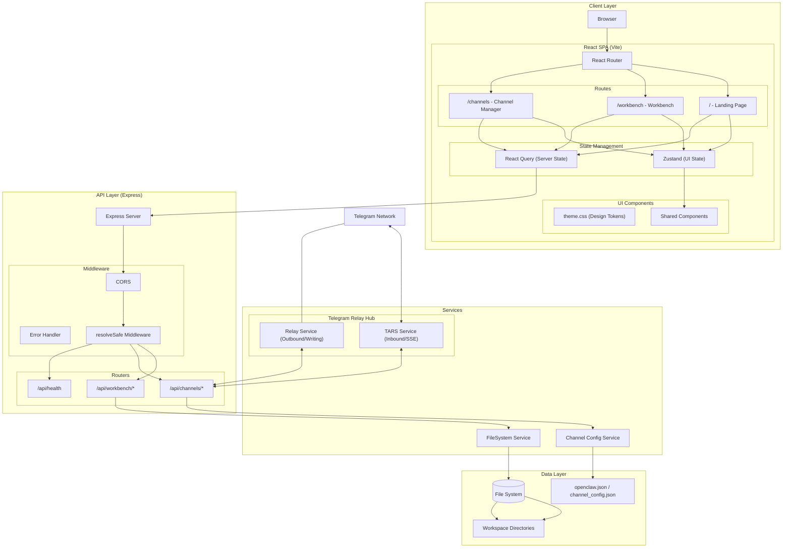
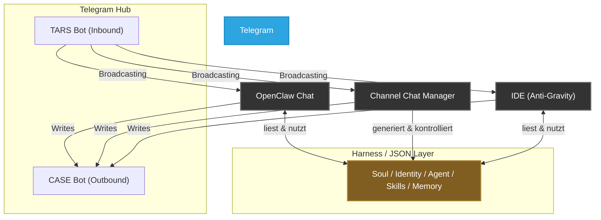
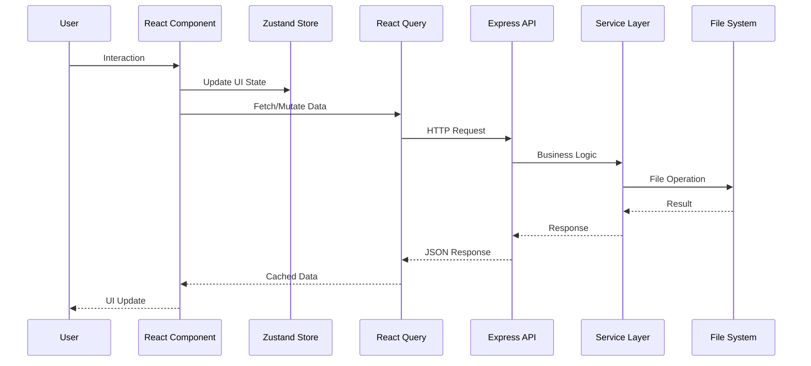
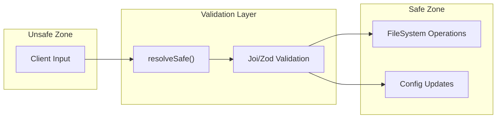
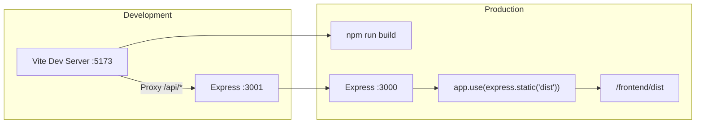

# OpenClaw UI Extensions - Production Architecture

**Version**: 1.0.0 | **Date**: 12.04.2026 | **Time**: 03:07 | **GlobalID**: 20260412_0307_ARCHITECTURE_v1

**Last Updated:** 12.04.2026 03:07  
**Framework:** Horizon Studio Framework  
**Status:** active

**Git:** Repo: Openclaw-OpenUSDGoodtstart-Extension | Branch: main | Path: Prodution_Nodejs_React/ARCHITECTURE.md | Commit: pending

**Tag block:**
#architecture #openclaw #telegram_hub

---

## System Overview



## Decentralized Telegram Hub (Data Flow)



### Der Datenfluss:

1. **Kommunikation (Zwei-Bot-Relay):** Wir nutzen eine **Asymmetrische Bot-Architektur**, um die 409-Kollision (Polling) und das Bot-zu-Bot Blocking zu umgehen. 
   - **TARS (Inbound):** Fungiert als Receiver. Er liest den Input und liefert den KI-Output an Telegram.
   - **Relay Bot / CASE (Outbound):** Das UI und die IDE nutzen **nicht** den TARS-Token zum Senden, sondern einen dedizierten Relay-Bot.
   - **Vorteil:** Nachrichten des Nutzers erscheinen in Telegram als `CASE` (oder Shedly), wodurch TARS sie als "Eingabe von Außen" erkennt und darauf antworten kann.

2. **Konfiguration (Das Gehirn):**
   - Der **Channel Chat Manager** ist das Werkzeug, mit dem die Rahmenbedingungen (Harness, Soul, Identity, Agenten-Zuweisung, Skills) konfiguriert werden. Er generiert die JSON-Files (in `openclaw.json` / Workspace).
   - **OpenClaw** liest diese JSON-Files aus, wenn es bootet / Anfragen empfängt, um einen konsistenten Agenten darzustellen.
   - Die **IDE** greift ebenfalls auf diese JSONs zurück, um zu wissen, wer der Agent ist und welche Skills er hat.

Das bedeutet für unseren Channel Manager: Wir hängen uns **nicht** an den Rockzipfel von OpenClaw, sondern binden in unserem Node.js Backend direkt die Telegram API (bzw. eine unabhängige Brücke zu TG) an!

### ⚠️ Architektur-Risiken & Edge Cases (Marvin's Audit)
Dieses radikal dezentrale Setup bringt operative Herausforderungen (Edge Cases) mit sich, für die unsere Architektur zwingend Mitigation-Patterns implementieren muss:
1. **Das Live-Streaming-Problem (Telegram Rate Limits):** LLMs generieren Token in sehr hoher Frequenz. Telegram sanktioniert extrem schnelle Message-Edits (HTTP 429). Die Echtzeit-Darstellung (Tipp-Indikator, Token-Streaming) wird daher über den Side-Channel (lokale WebSockets/SSE) des Backends an das native React-UI übertragen.
2. **Bot Polling Token-Kollision (HTTP 409) & Loop Protection:** (GELÖST via Zwei-Bot-Architektur). Durch die Trennung von TARS_READ (Polling/Streaming) und RELAY_SEND (CASE/Shedly API Calls) gibt es keine Token-Kollisionen mehr und keine Bot-zu-Bot Blockaden.
3. **Hot-Reloading der Datei-Konfiguration (JSON-Desync):** Da die Konfiguration dezentrierter File-System-Zustand ist, müssen File-Watcher (`chokidar`) in allen Runtimes implementiert werden, um Laufzeitänderungen ohne manuellen Neustart zu registrieren.
4. **Domain-Driven File Ownership (Race Condition Setup):** Ohne zentrale Datenbank drohen beim dezentralen Zugriff Schreibkollisionen auf dem Dateisystem. Zur Mitigation gilt strikte asymmetrische Datenhoheit (Bounded Contexts an der Dateigrenze): Der *Channel Manager* besitzt exklusives Schreibrecht (Write) für globale Konfigurationen (z.B. `openclaw.json`, `channel_config.json`), während AgentClaw/OpenClaw diese nur lesen (Read-Only). Umgekehrt haben die Agenten exklusives Schreibrecht auf Laufzeit- und Speicherdateien (`*.memory.md`, `runtime.stats.json`), welche der Channel Manager wiederum nur lesen darf. Dieses Setup eliminiert File-Locks.
## Directory Structure

```mermaid
graph LR
    subgraph "Root"
        Root["Openclaw-OpenUSDGoodstart-Extension/"]
        Prod["Prodution_Nodejs_React/"]
    end

    subgraph "Backend (/backend)"
        BE["backend/"]
        BERoutes["src/routes/"]
        BEServices["src/services/"]
        BEMiddleware["src/middleware/"]
        BEUtils["src/utils/"]
        BEServer["server.js"]
    end

    subgraph "Frontend (/frontend)"
        FE["frontend/"]
        FESrc["src/"]
        FEPages["pages/"]
        FEComponents["components/"]
        FEStores["stores/"]
        FEHooks["hooks/"]
        FEStyles["styles/"]
        FEMain["main.jsx"]
        FEApp["App.jsx"]
    end

    Root --> Prod
    Prod --> BE & FE
    BE --> BEServer --> BERoutes & BEServices & BEMiddleware & BEUtils
    FE --> FEMain --> FEApp --> FESrc
    FESrc --> FEPages & FEComponents & FEStores & FEHooks & FEStyles
```

## Data Flow



## Key Design Decisions

| Aspect | Decision | Rationale |
|--------|----------|-----------|
| **State Management** | Zustand + React Query | Zustand for UI state (fast), React Query for server state (caching) |
| **Styling** | CSS Variables + CSS Modules | Global theme tokens + scoped components |
| **Diff Viewer** | `react-diff-viewer` | Lightweight alternative to Monaco |
| **Tree Virtualization** | `react-window` | Performance for large directories |
| **Chat Hub Architecture** | Native React Component | Replacement of the legacy Iframe with a sovereign, TG-connected client |
| **Safety** | `resolveSafe` middleware | Absolute path traversal protection |

## API Endpoints

### Workbench API
```
GET    /api/workbench/tree?path=/workspace
GET    /api/workbench/file?path=/workspace/file.md
POST   /api/workbench/file (body: {path, content})
GET    /api/workbench/search?q=query
GET    /api/workbench/preview?path=/workspace/file.md
```

### Channels API
```
GET    /api/channels/config
POST   /api/channels/config (body: config)
GET    /api/channels/groups
POST   /api/channels/:id/skills
DELETE /api/channels/:id/skills/:skill
POST   /api/channels/:id/model
```

## Security Boundaries



## Build & Deploy



## Recommended Tech Stack

| Layer | Technology |
|-------|------------|
| Frontend Framework | React 18 + Vite |
| Routing | react-router-dom |
| State (UI) | Zustand |
| State (Server) | React Query (@tanstack/react-query) |
| Styling | CSS Variables + CSS Modules |
| Icons | Lucide React |
| Diff Viewer | react-diff-viewer |
| Tree Virtualization | react-window |
| Backend | Express.js |
| Validation | Zod |
| File Watching | chokidar (optional) |
