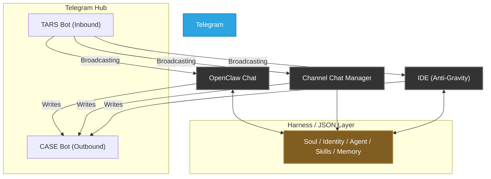
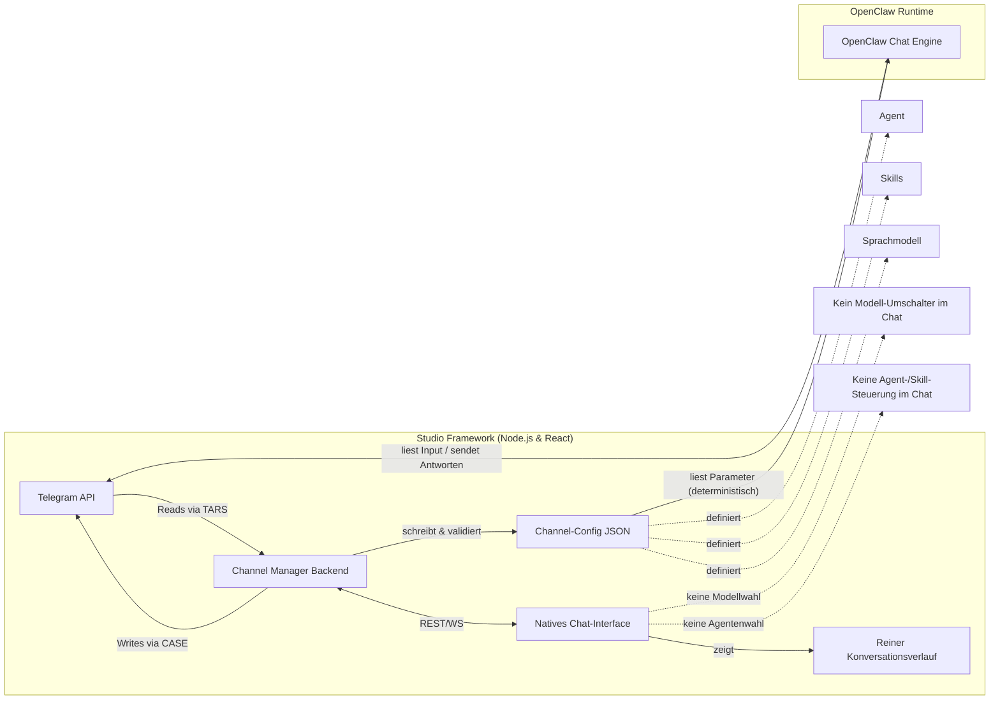

# Spezifikation & Kernanforderungen: Centralized Channel Management

**Version**: 1.0.0 | **Date**: 12.04.2026 | **Time**: 03:07 | **GlobalID**: 20260412_0307_SPECIFICATION_v1

**Last Updated:** 12.04.2026 03:07  
**Framework:** Horizon Studio Framework  
**Status:** active

**Git:** Repo: Openclaw-OpenUSDGoodtstart-Extension | Branch: main | Path: Prodution_Nodejs_React/CHANNEL_MANAGER_SPECIFICATION.md | Commit: pending

**Tag block:**
#specification #channel_manager #requirements

---

## 1. Einleitung & Vision

Die Architektur wird konsequent in Richtung einer zentral gesteuerten, systemübergreifenden Kommunikations- und Steuerungsschicht ausgerichtet. Dies ist essentiell für die geplante Einbindung in **Antigravity**.

*   **Zentrale Steuerung:** OpenClaw verantwortet **Governing**, **Harness** und die operative Ausführung.
*   **Kommunikations-Hub:** Telegram fungiert als zentrale Einheit, die Gespräche organisiert, transportiert und verteilt.

### Ziel-Endpunkte des Gesprächsflusses:
1.  **Telegram:** Primärer Kommunikationskanal.
2.  **OpenClaw Chat-Interface:** Natives React-Interface (vollständig entkoppelt).

**Kern-Dogma:** Fachliche Steuerung findet **nicht** in den Chat-Oberflächen statt, sondern ausschließlich im **Channel Manager**. Eine dort gesetzte Konfiguration (Modell, Agent, Skills) ist systemweit verbindliche Laufzeitquelle.

### Kommunikations-Protokoll (Multi-Bot Architektur)
Die Native UI kommuniziert mit Telegram weiterhin über die robuste **Telegram Bot API**, nutzt dafür aber einen dezidierten **zwei-Bot-Ansatz** zur klaren Identitäts-Trennung.
*   **Warum nicht MTProto?** MTProto erzeugt massiven Auth-Overhead (SMS-Handshake) und Session-Fragilität, was für ein lokales Entwickler-Werkzeug "over-engineered" ist.
*   **Die Relay Bot Lösung (CASE):** Die UI sendet Nachrichten nicht länger über den TARS-Token. Stattdessen wird ein zweiter Telegram-Bot (`Shedly_BTF` / `CASE`) erstellt und in die Arbeitsgruppen eingeladen. 
    *   **Lesen (Inbound):** Erfolgt weiterhin über die TARS Bot API (Live-Stream, SSE).
    *   **Schreiben (Outbound):** Erfolgt über den `RELAY_BOT_TOKEN`. Nachrichten des Nutzers erscheinen im Chat somit klar als `[CASE]`, während KI-Antworten unter `[TARS]` firmieren. Dies bietet maximale Stabilität bei 100% visueller Klarheit und umgeht die Bot-zu-Bot Blockade.

---

## 2. Architektonische Übersicht

### Grundprinzip: Trennung von Control & Communication
Die Architektur basiert auf der strikten Trennung zwischen:
1.  **Zentraler Steuerung:** Konfiguration, Routing und Ausführungskontext (Channel Manager).
2.  **Verteilter Kommunikation:** Anzeige, Interaktion und Synchronisierung (Telegram als Bus).

### Rollen der Hauptkomponenten

| Komponente | Hauptaufgabe | Detail-Verantwortung |
| :--- | :--- | :--- |
| **OpenClaw** | Engine / Logic | Governing, Harness, Ausführung der Agentenlogik. |
| **Telegram** | Message Bus | Nachrichtenverteilung (Eingang/Ausgang), Synchronisierung der Oberflächen. |
| **Channel Manager** | Source of Truth | Zuweisung von Kanälen, Agenten, Modellen, Skills und Kontext-Parametern. |
| **Chat-Interface** | Interaction Layer | Visualisierung des Nachrichtenflusses, Erfassung von User-Input. |
| **Antigravity** | IDE Client | Konsum des zentralen Gesprächszustands im Entwicklungskontext. |

---

## 3. Zielbild der Architektur (Hub-and-Spoke)

---

## 4. Implementation Part: Das neue Chat-Modell

### Zielsetzung
Es entsteht ein schlankes Chat-Interface (Konversationsebene), das frei von fachlicher Steuerlogik (Steuerungsebene) ist. Der Zustand muss beim Öffnen **deterministisch** sein.

### Kernanforderungen (Requirements)

#### R1: Dediziertes, reduziertes Interface
*   **Fokus:** Konversationsverlauf, Streaming-Ausgabe, Texteingabe.
*   **Ausschluss:** Keine Modellwahl, keine Agenten-/Skill-Umschaltung im Chat-Tab.

#### R2: Autoritativer Channel Manager
*   Liest alle Parameter (Modell, Agent, Subagenten, Skills) aus dem `Channel-Config JSON`.
*   Das Chat-Interface übernimmt diese Werte ausschließlich lesend.

#### R3: Deterministisches Öffnungsverhalten
*   Nutzer landet beim Klick auf "Chat" im Channel Manager sofort im korrekt vorkonfigurierten Raum.
*   Keine manuelle Nachkonfiguration nötig (der Kanal ist bereits am Agenten/Modell gebunden).

#### R4: Telegram-Relay als Nachrichten-Bus
1.  **Inbound:** TARS Bot API liefert Rohdaten (Polling/Webhook).
2.  **Logic:** OpenClaw Engine verarbeitet die Anfrage im definierten Kontext.
3.  **Outbound:** UI/Nutzer-Eingaben werden über den **Relay Bot (CASE)** gesendet.
4.  **Sync:** Alle Oberflächen (UI, Telegram, IDE) bleiben durch den gemeinsamen Message-Hub konsistent.

---

## 5. Detaillierter Nachrichten- & Konfig-Fluss

---

## 6. Zusammenfassung für die Umsetzung
Die anstehenden Arbeiten sind keine reinen UI-Retuschen, sondern die Implementierung eines systemweiten Synchronisations-Templates. 

*   Weg von lokal konfigurierten Chat-Fenstern.
*   Hin zu einer zentral orchestrierten Kommunikationsarchitektur.
---

## 7. Gap-Analyse & Status Quo

Um den Weg von der aktuellen Implementierung hin zur Ziel-Spezifikation (Hub-and-Spoke) zu ebnen, wurde folgende Analyse der bestehenden Lücken durchgeführt:

| Bereich | Gap (Lücke) | Gewichtung / Aufwand |
| :--- | :--- | :--- |
| **Data Integrity** | Frontend-Konstanten (`AVAILABLE_MODELS`, `SKILL_METADATA`) sind statisch in `ChannelManager.jsx` hinterlegt. Das UI muss diese Daten dynamisch vom Backend beziehen. | **Medium** (Refactoring) |
| **Chat Determinismus** | Implementiert via **Zwei-Bot-Relay** (CASE/Shedly). Umgeht 409-Polling-Kollision und Bot-Blocking. | **Done** |
| **UI-Reduzierung** | Vollständige Ablösung des Iframes durch ein natives React-Chat-Component. | **Done** |
| **Skill Sync** | Das Tool `sync_skills.py` ist fehlerhaft (hashing) und noch nicht bidirektional (Hegelianer-Ansatz). | **Medium** (Scripting) |
| **Persistence** | Resizing-Höhen der Chat-Zeilen werden bei Neuladen vergessen. | **Easy** (Local Storage) |

Diese Analyse dient als Grundlage für den dedizierten [Implementierungsplan](file:///media/claw-agentbox/data/9999_LocalRepo/Openclaw-OpenUSDGoodtstart-Extension/Prodution_Nodejs_React/CHANNEL_MANAGER_IMPLEMENTATION_PLAN.md).

---

## 8. Architektur-Risiken & Edge Cases (Audit)

Bei der Entkopplung der UI vom Iframe hin zu einem reinen "Telegram Hub"-Ansatz bestehen folgende architektonische Fallstricke, die zwingend abgefangen werden müssen:

1. **Das Live-Streaming-Problem (Telegram Rate Limits):** Ein LLM generiert Outputs als hochfrequenten Token-Stream. Telegram erlaubt jedoch nur ca. 1 Editierung pro Sekunde (HTTP 429 Too Many Requests bei Verstoß). Um ein reibungsloses Typing-Feedback im UI (wie bisher per Iframe) zu erhalten, reicht Telegram als *alleiniger* Message-Bus nicht aus. Es bedarf eines hybriden Ansatzes, bei dem Telegram die finale Historie verwaltet, aber ein Backend/Agent-Sidechannel via WebSocket/Server-Sent-Events den Live-Tipp-Zustand direkt an das React-UI überträgt.
2. **Bot Polling Array-Kollision (HTTP 409):** Greifen mehrere Long-Polling-Clients (Node.js Backend, AgentClaw in IDE, OpenClaw) mit demselben Bot Token auf Telegram zu, fangen sie sich gegenseitig die Nachrichten weg oder werfen Connection-Errors. Lösung: Saubere Trennung der Bot/User-Accounts (MTProto für UI, Bot-Token für Agent) oder lokales Pub/Sub über den Channel Manager.
3. **Hot-Reloading (JSON-Desync):** Wenn der Channel Manager die Konfig-Dateien ändert, müssen AgentClaw und OpenClaw dies sofort mitbekommen. Ein Dateisystem-Watcher (`chokidar`) in den Laufzeitumgebungen ist zwingend erforderlich, damit Agenten "on-the-fly" umkonfiguriert werden, ohne manuelle Neustarts zu benötigen.
4. **Domain-Driven File Ownership (Race Conditions):** Ohne File-Locking führen gleichzeitige Schreibzugriffe von IDE und Channel Manager zur Korruption der JSON-Dateien. Um dies zu verhindern, gilt das Konzept "Bounded Contexts": Der Channel Manager hat *exklusives Schreibrecht* für Top-Down Konfigurationen (`openclaw.json`), während AgentClaw nur Lese-Rechte (Read-Only) darauf besitzt. Im Gegenzug hat AgentClaw exklusives Schreibrecht für sein Bottom-Up Gedächtnis (`*.memory.md`), welches der Channel Manager nur betrachten darf.
